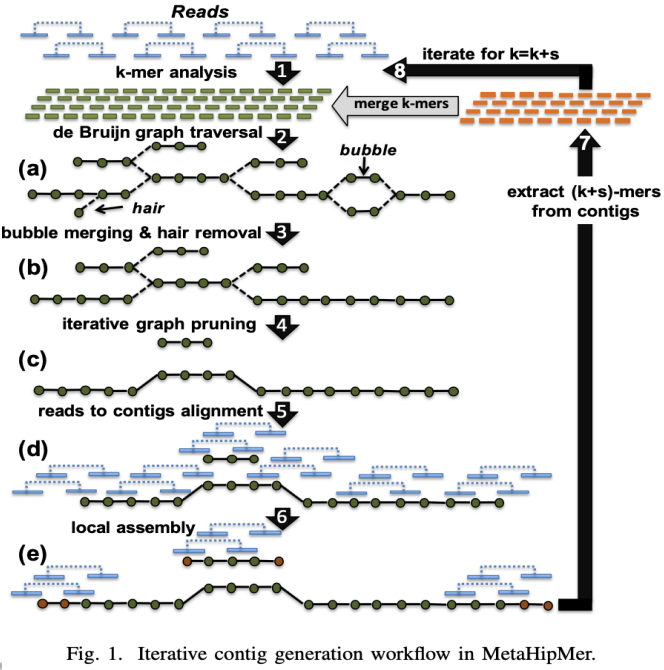

# MHM2 Adjusting k-mers
A method of visualizing k-mers, the k-mer spectrum, shows the multiplicity of each k-mer in a sequence versus the number of k-mers with that multiplicity. It requires a DHT to store the sequence.

The default parameters are good enough for the dataset in the competition.

- Modifying those parameters will influence accuracy.
    - Adding an iteration will slightly increase the # of long sequences, the result still stays in acceptable range, but the speed is about 1/7 slower than original.
    - Removing an iteration will greatly increase speed (about 1/7 compared to original), but the result will differ dramatically from reference.
    - Adjusting the values of k will not make MHM2 much faster/slower, and the result would still be acceptable if k is not changed dramatically.

- From the paper, we learn that the preset k is good enough for most of the cases
    - Too large k is not fair to low-coverage genomes
    - Too small k may not be able to detect errors produced by the sequencer.

