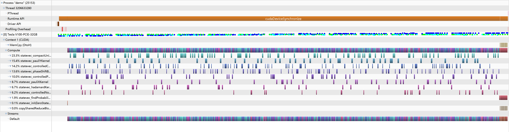

<!-- TITLE: Quest -->
<!-- SUBTITLE: A quick summary of Quest -->

# quest analysis

## program goal analysis

what's code is actually doing is to simulate quantum computing.


### different bits state - qubits

3 states: `1` `0` `0/1`

store by qreal which is actualy a complex number a+bi  (a+b=1), and it can be stated as \\( (\begin{smallmatrix}0.123124&0\\0&0.876876\end{smallmatrix}) \\) , also note that because gpu only support float32 computing. So native qreal (precision=4) is not supported in gpu simutation.

```cpp
/*
 * Single precision, which uses 4 bytes per amplitude component
 */
# if QuEST_PREC==1
    # define qreal float
    // \cond HIDDEN_SYMBOLS   
    # define MPI_QuEST_REAL MPI_FLOAT
    # define MPI_MAX_AMPS_IN_MSG (1LL<<29) // must be 2^int
    # define REAL_STRING_FORMAT "%.8f"
    # define REAL_QASM_FORMAT "%.8g"
    # define REAL_EPS 1e-5
    # define absReal(X) fabs(X) // not fabsf(X) - better to return doubles where possible
    // \endcond
/*
 * Double precision, which uses 8 bytes per amplitude component
 */
# elif QuEST_PREC==2
    # define qreal double
    // \cond HIDDEN_SYMBOLS   
    # define MPI_QuEST_REAL MPI_DOUBLE
    # define MPI_MAX_AMPS_IN_MSG (1LL<<28) // must be 2^int
    # define REAL_STRING_FORMAT "%.14f"
    # define REAL_QASM_FORMAT "%.14g"
    # define REAL_EPS 1e-13
    # define absReal(X) fabs(X)
    // \endcond
/*
 * Quad precision, which uses 16 bytes per amplitude component.
 * This is not compatible with most GPUs.
 */
# elif QuEST_PREC==4
    # define qreal long double
    // \cond HIDDEN_SYMBOLS   
    # define MPI_QuEST_REAL MPI_LONG_DOUBLE
    # define MPI_MAX_AMPS_IN_MSG (1LL<<27) // must be 2^int
    # define REAL_STRING_FORMAT "%.17Lf"
    # define REAL_QASM_FORMAT "%.17Lg"
    # define REAL_EPS 1e-14
    # define absReal(X) fabsl(X)
    // \endcond
# endif
```


### many matrices computation


all of the gate corresponds to one of the manipulation on qubits.

#### Basic operation on a and b https://arxiv.org/pdf/quant-ph/0207118.pdf

random variables = density matrix 

**hermitian**:\\(\rho^T=\rho\\)

**positive semidefinite**:  **eigenvalue** \\(\geq\\) 0

**trace**: \\(\Sigma(diagnal\ elements)=1\\)

dirac notation: ket \\(v_{\phi}=|\phi\rangle=\left(\begin{array}{l}\phi_{0} \\\phi_{1}\end{array}\right)\\)

bra   \\( v_{\phi}^T=\langle\phi|=\left(\begin{array}{ll}\phi_{0} & \phi_{1}\end{array}\right)\\)

\\(\langle\phi \mid \psi\rangle\\)= inner products of bra(fi) and ket(theta). notice: \\(\langle\phi \mid \phi\rangle=1\\)

\\(|\phi\rangle|\psi\rangle\\)=tensor product of ket(fi) and bra(theta)

2 special notation: \\(u_{0}=|0\rangle=\left(\begin{array}{l}1 \\0\end{array}\right) \quad v_{1}=|1\rangle=\left(\begin{array}{l}0 \\1\end{array}\right)\\)

the dense **matrix**:\\(\rho=\left(\begin{array}{cc}q_{0} & 0 \\0 & q_{1}\end{array}\right)\\) (\\(q_{0}+q_{1}=1\\), the purpose of the equation is to illustrate the complex number ) can be stated  as \\(\rho=q_{0}|0\rangle\left\langle 0\left|+q_{1}\right| 1\right\rangle\langle 1|\\)

so \\(\rho|0\rangle=\left(q_{0}|0\rangle\left\langle 0\left|+q_{1}\right| 1\right\rangle\langle 1|\right)|0\rangle=q_{0}|0\rangle\\)

dot product (from normal bits to qubits):\\(|a b\rangle=|a\rangle \otimes|b\rangle=v_{00}|00\rangle+v_{01}|01\rangle+v_{10}|10\rangle \dashv v_{11}|11\rangle \rightarrow\left[\begin{array}{l}v_{00} \\v_{01} \\v_{10} \\v_{11}\end{array}\right]\\)


for example in bits 5 = 101b, while in qubits \\(|5\rangle_{3}=|101\rangle=|1\rangle|0\rangle|1\rangle=\left(\begin{array}{l}0 \\1\end{array}\right)\left(\begin{array}{l}1 \\0\end{array}\right)\left(\begin{array}{l}0 \\1\end{array}\right)=\left(\begin{array}{l}0 \\0 \\0 \\0 \\0 \\1 \\0 \\0\end{array}\right)\\)


#### Hadamard gate operations

\[\begin{aligned}H(|0\rangle) &=\frac{1}{\sqrt{2}}|0\rangle+\frac{1}{\sqrt{2}}|1\rangle=:|+\rangle \\H(|1\rangle) &=\frac{1}{\sqrt{2}}|0\rangle-\frac{1}{\sqrt{2}}|1\rangle=:|-\rangle \\H\left(\frac{1}{\sqrt{2}}|0\rangle+\frac{1}{\sqrt{2}}|1\rangle\right) &=\frac{1}{2}(|0\rangle+|1\rangle)+\frac{1}{2}(|0\rangle-|1\rangle)=|0\rangle \\H\left(\frac{1}{\sqrt{2}}|0\rangle-\frac{1}{\sqrt{2}}|1\rangle\right) &=\frac{1}{2}(|0\rangle+|1\rangle)-\frac{1}{2}(|0\rangle-|1\rangle)=|1\rangle\end{aligned}\]

corresponding matrix operation in dirac notation: \\(H_{1}=\frac{1}{\sqrt{2}}\left(\begin{array}{cc}1 & 1 \\1 & -1\end{array}\right)\\)

some specialty:
1. \\(H=\frac{|0\rangle+|1\rangle}{\sqrt{2}}\langle 0|+\frac{|0\rangle-|1\rangle}{\sqrt{2}}\langle 1|\\)
2. Since  where *I* is the identity matrix, *H* is a [unitary matrix](https://en.wikipedia.org/wiki/Unitary_matrix) (like all other quantum logical gates). Also, it is its own [unitary inverse](https://en.wikipedia.org/wiki/Unitary_matrix), .


One application of the Hadamard gate to either a 0 or 1 qubit will produce a quantum state that, if observed, will be a 0 or 1 with equal probability (as seen in the first two operations). This is exactly like flipping a fair coin in the standard [probabilistic model of computation](https://en.wikipedia.org/wiki/Probabilistic_Turing_machine). However, if the Hadamard gate is applied twice in succession (as is effectively being done in the last two operations), then the final state is always the same as the initial state.

```cpp
__global__ void statevec_hadamardKernel (Qureg qureg, const int targetQubit){
    // ----- sizes
    long long int sizeBlock,                                           // size of blocks
         sizeHalfBlock;                                       // size of blocks halved
    // ----- indices
    long long int thisBlock,                                           // current block
         indexUp,indexLo;                                     // current index and corresponding index in lower half block

    // ----- temp variables
    qreal   stateRealUp,stateRealLo,                             // storage for previous state values
           stateImagUp,stateImagLo;                             // (used in updates)
    // ----- temp variables
    long long int thisTask;                                   // task based approach for expose loop with small granularity
    const long long int numTasks=qureg.numAmpsPerChunk>>1;

    sizeHalfBlock = 1LL << targetQubit;                               // size of blocks halved
    sizeBlock     = 2LL * sizeHalfBlock;                           // size of blocks

    // ---------------------------------------------------------------- //
    //            rotate                                                //
    // ---------------------------------------------------------------- //

    //! fix -- no necessary for GPU version
    qreal *stateVecReal = qureg.deviceStateVec.real;
    qreal *stateVecImag = qureg.deviceStateVec.imag;

    qreal recRoot2 = 1.0/sqrt(2.0);

    thisTask = blockIdx.x*blockDim.x + threadIdx.x;
    if (thisTask>=numTasks) return;

    thisBlock   = thisTask / sizeHalfBlock;
    indexUp     = thisBlock*sizeBlock + thisTask%sizeHalfBlock;
    indexLo     = indexUp + sizeHalfBlock;

    // store current state vector values in temp variables
    stateRealUp = stateVecReal[indexUp];
    stateImagUp = stateVecImag[indexUp];

    stateRealLo = stateVecReal[indexLo];
    stateImagLo = stateVecImag[indexLo];

    stateVecReal[indexUp] = recRoot2*(stateRealUp + stateRealLo);
    stateVecImag[indexUp] = recRoot2*(stateImagUp + stateImagLo);

    stateVecReal[indexLo] = recRoot2*(stateRealUp - stateRealLo);
    stateVecImag[indexLo] = recRoot2*(stateImagUp - stateImagLo);
}

void statevec_hadamard(Qureg qureg, const int targetQubit) 
{
    int threadsPerCUDABlock, CUDABlocks;
    threadsPerCUDABlock = 128;
    CUDABlocks = ceil((qreal)(qureg.numAmpsPerChunk>>1)/threadsPerCUDABlock);
    statevec_hadamardKernel<<<CUDABlocks, threadsPerCUDABlock>>>(qureg, targetQubit);
}
```


#### Pauli-X/Y/Z gate

The Pauli-X gate acts on a single qubit. It is the quantum equivalent of the \\(X=\left[\begin{array}{ll}0 & 1 \\1 & 0\end{array}\right]\\)

```cpp
void pauliX(Qureg qureg, const int targetQubit) {
    validateTarget(qureg, targetQubit, __func__);
    
    statevec_pauliX(qureg, targetQubit);
    if (qureg.isDensityMatrix) {
        statevec_pauliX(qureg, targetQubit+qureg.numQubitsRepresented);
    }
    
    qasm_recordGate(qureg, GATE_SIGMA_X, targetQubit);
}
```

the real computing part

```cpp
void statevec_pauliXLocal(Qureg qureg, const int targetQubit)
{
    long long int sizeBlock, sizeHalfBlock;
    long long int thisBlock, // current block
         indexUp,indexLo;    // current index and corresponding index in lower half block

    qreal stateRealUp,stateImagUp;
    long long int thisTask;         
    const long long int numTasks=qureg.numAmpsPerChunk>>1;

    // set dimensions
    sizeHalfBlock = 1LL << targetQubit;  
    sizeBlock     = 2LL * sizeHalfBlock; 

    // Can't use qureg.stateVec as a private OMP var
    qreal *stateVecReal = qureg.stateVec.real;
    qreal *stateVecImag = qureg.stateVec.imag;

# ifdef _OPENMP
# pragma omp parallel \
    default  (none) \
    shared   (sizeBlock,sizeHalfBlock, stateVecReal,stateVecImag) \
    private  (thisTask,thisBlock ,indexUp,indexLo, stateRealUp,stateImagUp) 
# endif
    {
# ifdef _OPENMP
# pragma omp for schedule (static)
# endif
        for (thisTask=0; thisTask<numTasks; thisTask++) {
            thisBlock   = thisTask / sizeHalfBlock;
            indexUp     = thisBlock*sizeBlock + thisTask%sizeHalfBlock;
            indexLo     = indexUp + sizeHalfBlock;

            stateRealUp = stateVecReal[indexUp];
            stateImagUp = stateVecImag[indexUp];

            stateVecReal[indexUp] = stateVecReal[indexLo];
            stateVecImag[indexUp] = stateVecImag[indexLo];

            stateVecReal[indexLo] = stateRealUp;
            stateVecImag[indexLo] = stateImagUp;
        } 
    }

}

void statevec_pauliXDistributed (Qureg qureg,
        ComplexArray stateVecIn,
        ComplexArray stateVecOut)
{

    long long int thisTask;  
    const long long int numTasks=qureg.numAmpsPerChunk;

    qreal *stateVecRealIn=stateVecIn.real, *stateVecImagIn=stateVecIn.imag;
    qreal *stateVecRealOut=stateVecOut.real, *stateVecImagOut=stateVecOut.imag;

# ifdef _OPENMP
# pragma omp parallel \
    default  (none) \
    shared   (stateVecRealIn,stateVecImagIn,stateVecRealOut,stateVecImagOut) \
    private  (thisTask)
# endif
    {
# ifdef _OPENMP
# pragma omp for schedule (static)
# endif
        for (thisTask=0; thisTask<numTasks; thisTask++) {
            stateVecRealOut[thisTask] = stateVecRealIn[thisTask];
            stateVecImagOut[thisTask] = stateVecImagIn[thisTask];
        }
    }
} 
```

```cpp
__global__ void statevec_pauliXKernel(Qureg qureg, const int targetQubit){
    // ----- sizes
    long long int sizeBlock,                                           // size of blocks
         sizeHalfBlock;                                       // size of blocks halved
    // ----- indices
    long long int thisBlock,                                           // current block
         indexUp,indexLo;                                     // current index and corresponding index in lower half block

    // ----- temp variables
    qreal   stateRealUp,                             // storage for previous state values
           stateImagUp;                             // (used in updates)
    // ----- temp variables
    long long int thisTask;                                   // task based approach for expose loop with small granularity
    const long long int numTasks=qureg.numAmpsPerChunk>>1;

    sizeHalfBlock = 1LL << targetQubit;                               // size of blocks halved
    sizeBlock     = 2LL * sizeHalfBlock;                           // size of blocks

    // ---------------------------------------------------------------- //
    //            rotate                                                //
    // ---------------------------------------------------------------- //

    //! fix -- no necessary for GPU version
    qreal *stateVecReal = qureg.deviceStateVec.real;
    qreal *stateVecImag = qureg.deviceStateVec.imag;

    thisTask = blockIdx.x*blockDim.x + threadIdx.x;
    if (thisTask>=numTasks) return;

    thisBlock   = thisTask / sizeHalfBlock;
    indexUp     = thisBlock*sizeBlock + thisTask%sizeHalfBlock;
    indexLo     = indexUp + sizeHalfBlock;

    // store current state vector values in temp variables
    stateRealUp = stateVecReal[indexUp];
    stateImagUp = stateVecImag[indexUp];

    stateVecReal[indexUp] = stateVecReal[indexLo];
    stateVecImag[indexUp] = stateVecImag[indexLo];

    stateVecReal[indexLo] = stateRealUp;
    stateVecImag[indexLo] = stateImagUp;
}

void statevec_pauliX(Qureg qureg, const int targetQubit) 
{
    int threadsPerCUDABlock, CUDABlocks;
    threadsPerCUDABlock = 128;
    CUDABlocks = ceil((qreal)(qureg.numAmpsPerChunk>>1)/threadsPerCUDABlock);
    statevec_pauliXKernel<<<CUDABlocks, threadsPerCUDABlock>>>(qureg, targetQubit);
}
```


## source code analysis

#### tree
```bash
.
├── CMakeLists.txt
├── include
│   ├── QuEST_complex.h				 //determine to use native external cpp support or c complex support.
│   ├── QuEST.h								  //main func claim
│   └── QuEST_precision.h				//define the precision
└── src
    ├── CMakeLists.txt
    ├── CPU
    │   ├── CMakeLists.txt
    │   ├── QuEST_cpu.c
    │   ├── QuEST_cpu_distributed.c	//distributed activator and implementation
    │   ├── QuEST_cpu_internal.h		 //other cpu related headers here
    │   └── QuEST_cpu_local.c			   //only cpu implementation
    ├── GPU
    │   ├── CMakeLists.txt
    │   └── QuEST_gpu.cu 					 //gpu counterpart
    ├── mt19937ar.c							  //梅森旋轉算法-伪随机数矩阵生成
    ├── mt19937ar.h
    ├── QuEST.c										//main func definition
    ├── QuEST_common.c					  //func activator defined here
    ├── QuEST_debug.h						  //debug information here
    ├── QuEST_internal.h
    ├── QuEST_qasm.c							//is a quantum record standard, defined qasm assertion here.
    ├── QuEST_qasm.h
    ├── QuEST_validation.c					//assert number of qubit here
    └── QuEST_validation.h
```
https://www.quantum-inspire.com/kbase/introduction-to-quantum-computing

## testcase analysis

`mytimer.hpp`

```cpp
#include <time.h>
#include <sys/time.h>
 
 double get_wall_time(){
 /* A time value that is accurate to the nearest
   microsecond but also has a range of years.  */
   struct timeval time;
 // __time_t tv_sec;		/* Seconds.  */
 // __suseconds_t tv_usec;	/* Microseconds.  */
   if (gettimeofday(&time,NULL)){
     // Handle error
     return 0;
   }
 
   return (double)time.tv_sec + (double)time.tv_usec * .000001;
 }
 
 double get_cpu_time(){
   return (double)clock() / CLOCKS_PER_SEC;//directly read clock from cpu, and return with clock times cloacks per sec.
 }```
```

`random.c` - random manipulation

```cpp
// total number of qubit: 30
// total number of qubit operatations: 667
// estimated time: 3783.9266747315614 second.
#include "QuEST.h"
#include "mytimer.hpp"
#include "stdio.h"

int main(int narg, char *argv[])
{

    QuESTEnv Env = createQuESTEnv();
    double t1 = get_wall_time();//define starting time 

    FILE *fp = fopen("probs.dat", "w");//open file for result
    if (fp == NULL) {
        printf("    open probs.dat failed, Bye!");
        return 0;
    }

    FILE *fvec = fopen("stateVector.dat", "w");
    if (fp == NULL) {
        printf("    open stateVector.dat failed, Bye!");
        return 0;
    }

    Qureg q =  createQureg(30, Env);//define qubits registers

    float q_measure[30];// defined q's size
   // possible execution.
    tGate(q, 25);
    controlledNot(q, 28, 21);
    controlledRotateX(q, 17, 5, 0.3293660327520663);
    tGate(q, 3);
    rotateX(q, 10, 4.734238389048838);
    rotateY(q, 8, 4.959946047271496);
    rotateZ(q, 5, 1.0427019597472071);
    pauliZ(q, 0);
	...
        
    printf("\n");
    for (long long int i = 0; i < 30; ++i) {
        q_measure[i] = calcProbOfOutcome(q, i, 1);
        printf("  probability for q[%2lld]==1 : %lf    \n", i, q_measure[i]);
        fprintf(fp, "Probability for q[%2lld]==1 : %lf    \n", i, q_measure[i]);
    }
    fprintf(fp, "\n");
    printf("\n");

    for (int i = 0; i < 10; ++i) {
        Complex amp = getAmp(q, i);
        printf("Amplitude of %dth state vector: %12.6f,%12.6f\n", i, amp.real,
               amp.imag);
    }

    double t2 = get_wall_time();
    printf("Complete the simulation takes time %12.6f seconds.", t2 - t1);
    printf("\n");
    destroyQureg(q, Env);
    destroyQuESTEnv(Env);

    return 0;
}
```

`GHZ_QFT.c` - only controlled manipulation

```cpp
/* GHZ quantum circuit */
    hadamard(q, 0);
    controlledNot(q, 0, 1);
    controlledNot(q, 1, 2);
    controlledNot(q, 2, 3);
    controlledNot(q, 3, 4);
    controlledNot(q, 4, 5);
    controlledNot(q, 5, 6);
    controlledNot(q, 6, 7);
    controlledNot(q, 7, 8);
    controlledNot(q, 8, 9);
    controlledNot(q, 9, 10);
    controlledNot(q, 10, 11);
    controlledNot(q, 11, 12);
    controlledNot(q, 12, 13);
    controlledNot(q, 13, 14);
    controlledNot(q, 14, 15);
    controlledNot(q, 15, 16);
    controlledNot(q, 16, 17);
    controlledNot(q, 17, 18);
    controlledNot(q, 18, 19);
    controlledNot(q, 19, 20);
    controlledNot(q, 20, 21);
    controlledNot(q, 21, 22);
    controlledNot(q, 22, 23);
    controlledNot(q, 23, 24);
    controlledNot(q, 24, 25);
    controlledNot(q, 25, 26);
    controlledNot(q, 26, 27);
    controlledNot(q, 27, 28);
    controlledNot(q, 28, 29);
	/* end of GHZ circuit */

	/* QFT starts */
    hadamard(q, 0);
    controlledRotateZ(q, 0, 1, 1.5708);
    hadamard(q, 1);
    controlledRotateZ(q, 0, 2, 0.785398);
    controlledRotateZ(q, 1, 2, 1.5708);
    hadamard(q, 2);
    controlledRotateZ(q, 0, 3, 0.392699);
    controlledRotateZ(q, 1, 3, 0.785398);
    controlledRotateZ(q, 2, 3, 1.5708);
    ...
```


## available test machine

1. 2node 16core each `mpi:omp=2:16`


   ```bash
   #!/bin/sh
   module purge
   spack load intel ##openmpi@3.1.5/3.1.2
   export PRECISION=4 ##1/2/4
   CC=icc CXX=icpc cmake -DGPUACCELERATED=0 -DDISTRIBUTED=1 ..
   make
   export OMP_NUM_THREADS=16
   export FI_PROVIDER=tcp
   mpirun -machinefile mac -np 2 ./demo 
   ```

   profiling result

   

   

   the most time-consuming part is statevec_compactUnitaryLocal

2. 2node 16core each `mpi:omp=1:32`

   

3. 1node 1tesla v100

   script

   ```bash
   #!/bin/sh
   module purge
   spack load gcc@6
   spack load cuda@10.1 ## 10.2
   export PATH=$PATH:/usr/local/cuda/bin
   export LD_LIBRARY_PATH=$LD_LIBRARY_PATH:/usr/local/cuda/lib64
   export LIBRARY_PATH=$LIBRARY_PATH:/usr/local/cuda/lib64
   
   export PRECISION=2 ##1/2
   CC=gcc CXX=g++ cmake -DGPUACCELERATED=1 -DGPU_COMPUTE_CAPABILIty=70 ..
   make
   ./demo 
   ```

   profiling result

   

summary


the summary for profiling of both cpu and gpu, the most time is consumed on computing the real kernel which I think the computing power is fully utilized. 

Accelerated percentage of single node over omp+mpi is 319.799/220.807=1.448319120317744‬‬

Accelerated percentage of single node over single gpu is 319.799/19.328=16.54627720533642

power consumption: over cpu:

​									over gpu: 111W on average

Our future plan: 

1. deploy the gpu code on multigpu using nccl.
2. solve the global memory store and load efficiency.

## misc

Loves from Github
1. https://github.com/QuEST-Kit/QuEST/issues/220

```
Hi Jiachen,

There are no plans currently to combine distribution with GPU-acceleration. Note there are a few ways this can be done, and I suspect none really align with QuEST's design philosophy, nor are practical due to memory overheads. I've wanted to pen these thoughts for a while, so read on below if interested! :)

Firstly, QuEST uses its hardware to accelerate the simulation of a single quantum register at a time. While I think there are good uses of multi-GPU to speedup simultaneous simulation of multiple registers, this would be a totally new pattern to QuEST's simulation style. So let's consider using multi-GPU to accelerate a single register.

There are a few ways you can have "multiple GPUs":

multiple NVlinked GPUs
This is when you have multiple GPUs tightly connected with a high-bandwidth fabric (e.g. this). The bandwidth is enough that you sort of can imagine it as a single big GPU, and hence it would be worthwhile for accelerating single-register simulation. However, this only exists right now as NVLink and NVSwitch, compatible only with IBM's POWER architecture - you could argue this is still esoteric, and not worth a big refactor. Note it wouldn't actually be very hard to refactor QuEST for this platform - indeed QuEST works out-of-the-box with POWER8. But it's not something on our TODO list currently.

multiple local GPUs
This is when you have multiple GPUs on the same machine, but maybe on different sockets and hence with a much lower bandwidth between them. The most common case is two GPUs - is it worthwhile using two GPUs over one to speedup single register simulation? Often, no!
In big QC simulation, having to move memory around is often the big killer, and should be avoided where possible. Unfortunately, simulating unitaries on registers often requires moving memory. If all the memory stays in the GPU (very high "internal bandwidth"), this is ok, but copying memory to the other GPU (across the socket) will introduce a huge per-gate overhead!
Hence, using two GPUs to simulate the same register size can be slower than using just one, especially as the simulation size grows and saturates the sockets!
There's hardly a benefit from the extra VRAM too, because doubling the memory enables simulation of one additional qubit. This is not worth the slowdown, or the hardware!
Even with more than two GPUs, the connections are likely hierarchical and so even more prone to saturation.

distributed GPUs
This is when you have a GPU(s) on each distributed node of a cluster. In this circumstance, simulating a unitary gate which requires data exchange not only costs us a VRAM to RAM overhead (similar to before), but a networking overhead to talk to the other nodes! This can be somewhat improved by having a direct GPU to network-card connection (and MPI abstraction), but I believe that's pretty cutting-edge.
Let's say you have n nodes, each with a GPU and a multicore CPU, and you're resolved to a distributed simulation. When is it worthwhile to pay the extra memory overhead locally copying from RAM to VRAM (and use the GPU), over using just the CPUs? This is now the same trade-off to consider in the previous cases. So may or may not be worthwhile.

TL-DR: besides the somewhat esoteric case of having multiple tightly-connected GPUs, multi-GPU simulation introduces a new memory overhead that doesn't exist in single-GPU simulation. This overhead is almost always way longer than the time the GPU spends simulating the gate. As to whether the whole simulation is sped up by the use of multi-GPU is system and simulation specific.
```
2. https://github.com/NVIDIA/nccl/pull/316
This is a PR for people to review and provide feedback on the p2p branch (issue [#212](https://github.com/NVIDIA/nccl/issues/212)).
```
Looking forward to applying the P2P function to increase the power of my project!
```