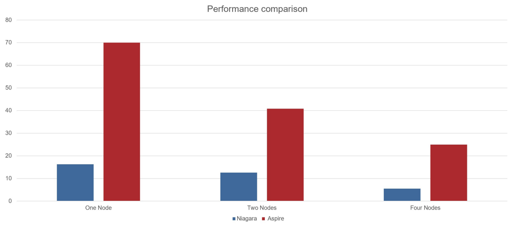

# GPAW

- Cython program
    - Pros and Cons of Hybrid MPI/OMP 
    - 70% runtime in C, 30% runtime in Python

- Computation intense program
    - Highly depend on Math library

- Hybrid MPI/OpenMP program
    - Pros and Cons of Hybrid MPI/OMP 
    - Balance of MPI/OpenMP

## GPU Accelerated
- ELPA
    - A highly efficient and highly scalable direct eigensolvers for symmetrix(hermitian) matrices.
    - with this math library, the performance can increase 3x-5x.

## Profiling
- Accroding to the IPM Profile information, we  figure out that MPI_Allredce is the most time comsuming.
  - We have tried profile the ratio of MPI and OpenMP since it is a Hybird MPI/OpenMP program, but the performance is unstable since different python use gpaw may have different calculate routines.

## Lesson Learned

- Python GIL Lock sometimes make profile difficult.

- Cython program usually have time cosuming part at C code, optimize this part.

- Some General Math Library (such as MKL) may not help a lot with specific program, but some minor specific Library will.
