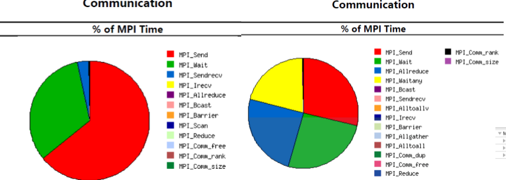
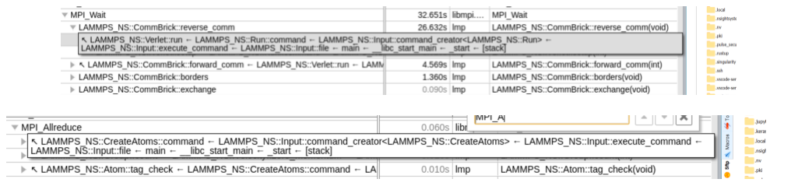
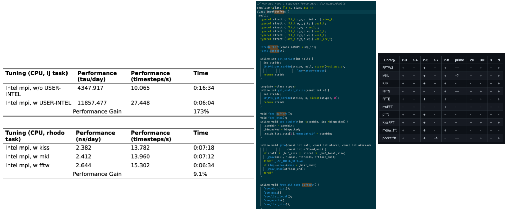
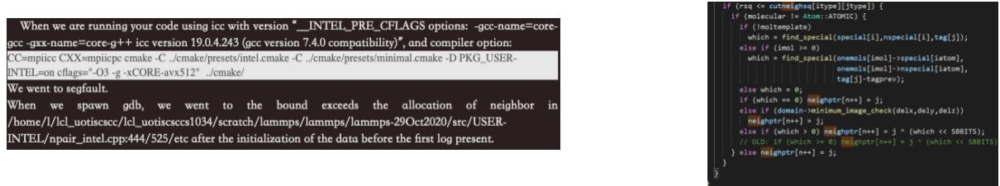

# LAMMPS

## Problem Discovery
- Intel Package by W. Michael Brown speed up the CPU performance roughly 2 times on both broadwell and skylake chassis. The only difference is -XCORE-avx512
- Communication Overhead is extremely unbalanced in Protein case because the Comm::Brick::reverse_comm calls MPI_Waitany too many times. This is solvable by define the grid box.

- Kokkos by LBNL is extremely useful for resource allocation of GPU. However, GPU does not have aggressive improvement may because of the sparse data.

## Result
- Intel Package Buffer - cache friendly and vectorized
- FFTW Comparison by project-gemmi/ mostly bfly 3D FFTW operation, which fftw is the best.

## Lesson Learned 
- The environment variable setting may affect the efficacy of the execution of the application. Besides, it may affect the efficiency of the application.
- Architecture may affect the performance.
  - AVX_512 may reduce CPU frequency, hence reduce performance.
- Multi-nodes do not guarantee the performance improvement.
  - Communication overhead may eat the performance gain.
- Dedicated package may introduce additional performance gain.
  - Most of the gain comes from the USER-INTEL package (by inte| ${ }^{\oplus}$ ).
- We found CMake is too smart to deal with the compiler option which trigger to half size of addme array in the half neighbor computation, once we change into make, the problem was solved.
- The Protein cases still get into segfault when using the Intel Package on NSCC, we roll back to no package for that single case.

