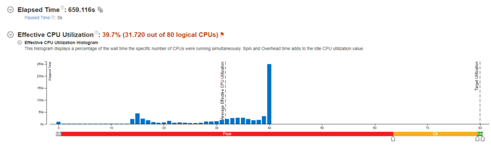
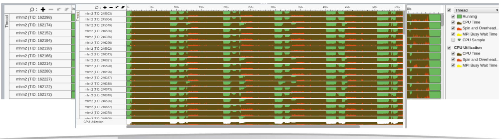
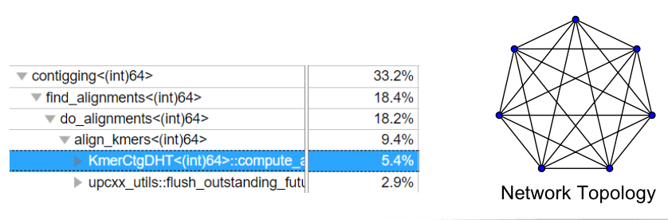
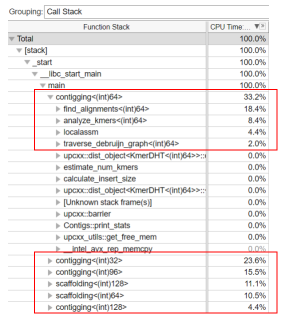
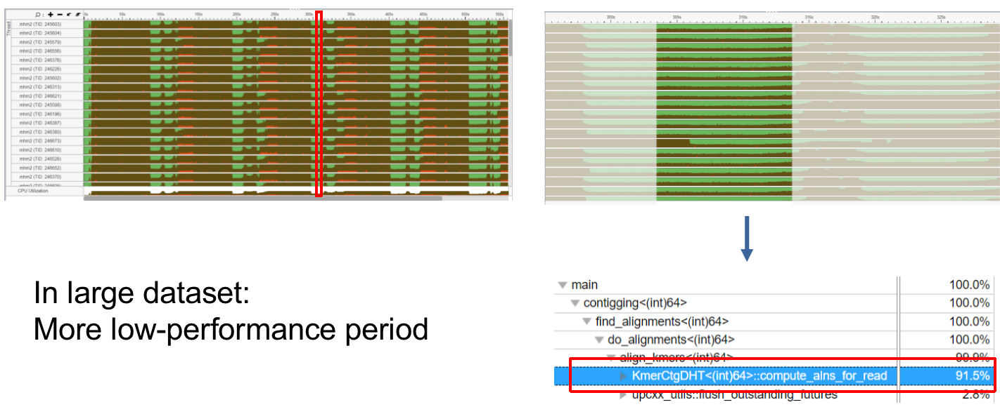
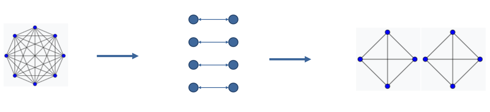
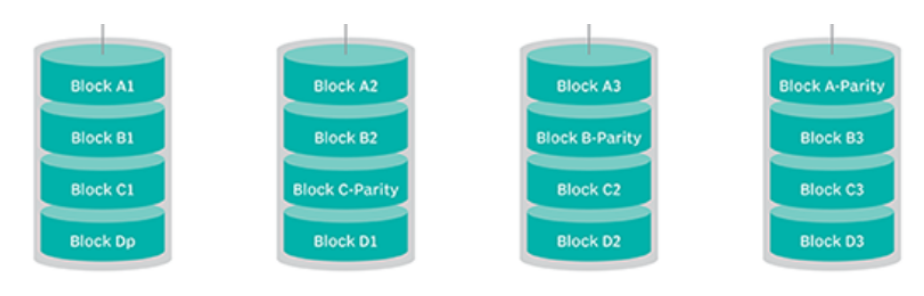

# MHM2
The code is written in UPC++

## Intro
- Multiple UPC++ backend: ibv, mpi, smp, udp
   - When based on mpi, UPC++ backend use the infiniband by default. 
- There is no significant performance difference between mpi and ibv. 
- The performance degradation after the increase of nodes is more serious than expected: more # of compute nodes: better DHT performance, but more network overhead.
    - Will be discussed in next few slides.
- Profiling is a little bit difficult.

\\[
\begin{array}{llrrrr} 
Conduit & Build Type & Report & System CPU & User CPU & nodes \\
\hline \textcolor{red}{mpi} & \textcolor{red}{Release} & \textcolor{red}{37.36} & \textcolor{red}{02: 54.9} & \textcolor{red}{1: 35: 15} & \textcolor{red}{4} \\
\hline mpi & Release & 60.74 & 01: 37.4 & 1: 19: 27 & 2 \\
\hline \textcolor{red}{ibv} & \textcolor{red}{Release} & \textcolor{red}{37.27} & \textcolor{red}{02: 57.3} & \textcolor{red}{1: 36: 37} & \textcolor{red}{4} \\
\hline ibv & Release & 61.69 & 01: 36.6 & 1: 19: 33 & 2 \\
ibv & Debug & 112.3 & 03: 44.6 & 4: 54: 57 & 4 \\
mpi & Debug & 134.4 & 06: 11.6 & 5: 57: 13 & 4 \\
mpi & Release & 37.79 & 07: 31.1 & 1: 39: 17 & 4 \\
mpi & Release & 545.35 & 1: 18: 27 & 18: 15: 26 & 4 \\
mpi & Release & 104.88 & 02: 54.6 & 1: 08: 33 & 1
\end{array}
\\]

## Profiling
- Profiler: Intel Vtune Amplifier/Profiler, Version 2019.6
UPC++ could rely on MPI, but infiniband has to be disabled to profile MPI model.

CPU utilization will be 80% if hyperthreading is disabled.

- Basically overall overhead is insignificant for small dataset (800MB)
- For large dataset (40GB), overhead is not neglectable
    - Not I/O bounded, network is the bottleneck
    - A lot of data exchange between nodes
- We exam the following two aspects: k-mers and DHT period

## DHT Analysis
- Three period: write only, read&write, read only.
- Write only part: data will be storage localized.
- Hyperscale data transmission when read-only: all to all.
- Bottleneck: Transmission restrictions cause function await.
This is mutually corroborated by the rate of performance degradation when the number of nodes increases: How to improve efficiency on larger clusters?

### Innovation 
- Highly redundant distributed hash table:
    - Reduce the order of the complete graph: as long as the memory allows.
    - Transfer data when write-only period: Network IO not significant, generating a redundant
    - For cluster with more memory: multiple redundancy.
    - Both reduce compute-alns part and read-only part

- Data reduction
    - Raid5-like Memory model
    - Using XOR to compute the data 
- Hyperparameter configuration
    - Adjust k value in k-mers analysis
    - We can achieve better results and less time comsumption by tuning the k parameter.

### Lesson Learned

- Setting up environment in the cluster
    - Use Spack and Module to manage user-mode packages.
- Learn how to use PBS and Slurm
    - Need balance between core occupied and waiting time.
- Any optimization in parallel program is very difficult.
    - Need to thoroughly consider Network, IO, Memory and core scheduling.
- Profiling in UPC++ can be hard:
    - Try to use other parallelization methods.
