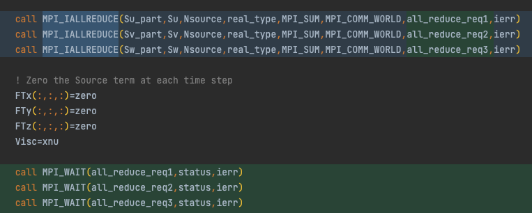

# Code Challenge for ISC22

# How do we improve the performance of Incompact3d

Jiajun Cheng Optimizing & profiling\, Zike Xu Deploying & Compiling

# Code optimization

Make it non\-blocking

By supplanting the blocking MPI calls to non\-blocking MPI calls\, we can do multiple AllReduce in parallel\.

Non\-blocking MPI calls enable Mvapich2\-DPU to offload data to DPU\.

If there are heavy computations\, between the IAllReduce and Wait\, we can save a lot of time\.

Make it non\-blocking

By supplanting the blocking MPI calls to non\-blocking MPI calls\, we can do multiple AllReduce in parallel\.

Non\-blocking MPI calls enable Mvapich2\-DPU to offload data to DPU\.

This is an example that there are computations between transpose\_start and transpose\_wait\.

Make it non\-blocking in detail

We removed the dependency relationship between Incompact3d and Libnbc\.

We did some Api conversions\. For example\, we replace NBC\_IALLTOALL with MPI\_IALLTOALL and NBC\_WAIT to MPI\_WAIT\.

Code optimization

Make it non\-blocking in detail

We must keep the buffer that we passed into the transpose\_start unchanged during the non\-blocking call\. Therefore\, we need buffers\.

To make a prototype\, we simply increase the number of buffers\. We can make a buffer pool when we have more time\.

Make it non\-blocking in detail

The key concept of making a blocking process into a non\-blocking process is to calculate the data dependency relationship between variables\, i\.e\.\, to trace the data flow\.

The variable relationship is shown in the figure\. We can see that we can calculate these arrays in parallel\.

Make it non\-blocking in detail

When the dataflow becomes complex\, adapting the code to be non\-blocking can be a nightmare\. It is hard for human to trace the dataflow\.

We think that compilers can handle this\. By analyzing the AST\, the compiler knows the dependencies between the variables\. It can automatically turn blocking MPI calls into non\-blocking MPI calls base on the dependency relationship\.

Make it non\-blocking in detail

However\, the optimizations that done by analyzing dataflow are limited\, the figure shows an tough circumstance which can hardly optimized by analyzing dataflow\.

The variables rely on each other very closely\. When we get the data from the MPI calls\, we immediately use the data\. Therefore\, there is no point changing the blocking MPI calls into non\-blocking ones\.

Make it faster

After we convert the blocking MPI calls into non\-blocking MPI calls\, we acquire an performance improvement around 6%\, even without DPU offloading\.

We noticed that a lot of MPI\_Alltoallv are replaced by MPI\_IalltoallV and MPI\_Wait\.

Make it faster

After we profiling the application\, we found a hotspot\.

Code optimization

Make it faster

The compiler fails to vectorize the calculation\, and we help the compiler to optimize the code\.

We inline the function sqrt\_prec manually\.

We use where statement and matrix operations\, instead of manipulate the array element one by one\.

Code optimization

Make it faster

Finally\, we get a performance improvement around 40%\.

The test data is based on the Xcompact3d for ISC22\, not Code challenge\.

# DPU offload

When the message size is between 16KB and 512KB\, the MPI will perform a DPU offload\.

When the message size is less than 8KB or more than 1MB\, the MPI will not perform a DPU offload\.

The overlapping can cover the cost of MPI communication\.

Mvapich2\-DPU only supports offloading non\-blocking MPI calls to DPU\.

In our case\, the speed up is not so obvious\.

Compare to the command line output in the last slide which shows the result of using DPU offloading\, the overlap decrease significantly\.

However\, the wallclock between two modes with DPU offloading and without DPU offloading are very close\.

Different buffer size

| PPN / Buffer Size / Kind | Alltoallv | Ialltoallv | Allreduce | Reduce | Iallreduce |
| :----------------------: | :-------: | :--------: | :-------: | :----: | :--------: |
|            4             |  1M/512K  |  1M/512K   |     8     |   8    |     /      |
|            8             |   256K    |    256K    |     8     |   8    |     2K     |
|            16            | 128K/64K  |  128K/64K  |     8     |   8    |     2K     |
|            32            |    32K    |    32K     |     8     |   8    |     2K     |

With the increase of PPN\, we buffer size of Alltoallv and Ialltoallv becomes smaller and smaller\.

We except when PPN is 8\, 16\, and 32\, DPU offloading will make an effect\, and a higher performance will be acquired\.

However\, the performance remains the same even though we enable the DPU offloading\.

The upper image is DPU offloading disabled\.

The other image is DPU offloading enabled\.

However\, the performance remains the same even though we enable the DPU offloading\.

The upper image is DPU offloading disabled\.

The other image is DPU offloading enabled\.

However\, the performance remains the same even though we enable the DPU offloading\.

The upper image is DPU offloading disabled\.

The other image is DPU offloading enabled\.

# Possible reasons

MVAPICH2 implements job balance between blocking MPI calls and non\-blocking MPI calls quite well\. DPU is unnecessary in this circumstance\.

The topology of Thor cluster has some issues\.

We do not use the correct network device\.

We configured the runtime wrongly which is the least possible\, since we get the reasonable overlapping result from the OSU MPI Non\-blocking All\-to\-All Latency Test\.

# Weak Scalability

We keep every process handle the same amount of data\.

For example\, the nx\, ny\, and nz for PPN=8 is 323\. The nx\, ny\, and nz for PPN=16 is 512\.

512\*512\*512/256 = 524\,288

323\*323\*323/64=526\,535

Different buffer size

| PPN / Buffer Size / Kind | Alltoallv | Ialltoallv | Allreduce | Reduce |
| :----------------------: | :-------: | :--------: | :-------: | :----: |
|            8             | 428K/512K | 428K/512K  |     8     |   8    |
|            32            |    1M     |     1M     |     8     |   8    |

With the increase of PPN\, we buffer size of Alltoallv and Ialltoallv becomes larger\.

It seems that the buffer is larger than 512K\, so DPU offloading may not make a difference\.

Different performance

We keep every process handle the same amount of data\.

With the increase of PPN and the problem size\, we find that the time increase significantly\.

# Strong Scalability

Different performance

We keep every process handle the same amount of data\.

With the increase of PPN and keep the problem size unchanged\, we find a pretty good strong scalability\.

We do not successfully submit the job 8x8 ppn8 with DPU\, so we use the data 8x8 ppn8 without DPU instead\.

# Difficulties

* We failed to pass environment variables such as IPM\_LOG=full to Xcompact3d\, so we change the source code of IPM and set the log level manually\.
* The Makefile of Xcompact3d is not well written\. We cannot compile successfully when the make job count is greater than 1\. Therefore\, we wrote CMakeLists\.txt and use Cmake to compile the project\.
* When we use FFTW3 as FFT backend\, the FFTW3LibraryDepends\.cmake is missing\, which is required by FFTW3Config\.cmake\. This issue has been existed for 4 years\, which still has not been solved see [https://github\.com/FFTW/fftw3/issues/130](https://github.com/FFTW/fftw3/issues/130)\.
  * We removed the dependency relationship between FFTW3Config\.cmake and FFTW3LibraryDepends\.cmake\.
  * We will make a pull request to fix the problem as soon as possible\.

# Lessons learned

* Submit jobs as early as possible
  * Thanks David\, he enable us to complete all the jobs\.
* Use build system like Spack can improve application performance and save time
  * We can switch between different FFT implementations by configs\.
  * We only meet a little compile problem with the help of Spack\.
  * Making custom Spack package is easy What we write is actually a DSL\.
* Non\-blocking calls can make better use of system resource
  * This concept has been widely used\, like the “async” keyword in programming languages\, non\-blocking MPI calls and message queue\.

# Innovation

* Describe an application that you took and can demonstrate innovation work upon
  * Using Intel MPI and Intel® Trace Analyzer and Collector to improve MPI Profiling\.
  * Using Arm Forge to Find Hotspots in Code level\.
  * Analyzing the FP ALU usage to diagnose the degree of vectorization\.
  * Changing blocking MPI calls into non\-blocking MPI calls in Xcompact3d\.
  * Using Spack as the build system during the competition\.
  * Putting forward the idea of changing the blocking MPI calls into non\-blocking MPI automatically by compilers\.
  * Discussing the weak scalability and strong scalability about Xcompact3d\.
