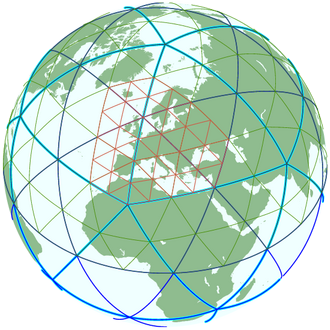

# ICON
- a unified next-generation global numerical weather prediction and climate modelling system
- Atmosphere and Ocean components
- in Grid Point Space on a Geodesic Icosahedral Grid
- MPI Application



## IPM Result


- Why 20 MPI Rank Having more MPI_WAIT time than others?
- How to Reduce MPI Call time and Balance MPI?

## Intel® Trace Analyzer and Collector Detailed MPI Profiling Result


* Intel® Trace Analyzer and Collector Detailed MPI Profiling
  * MPI Message Matrix


* Intel® Trace Analyzer and Collector Detailed MPI Profiling
  * MPI Trace


* Intel® Trace Analyzer and Collector Detailed MPI Profiling
  * MPI Pattern 1

__MPI Pattern 1 Barrier__


_Ocean Ranks always Waiting for Atmosphere Ranks_

* Intel® Trace Analyzer and Collector Detailed MPI Profiling
  * MPI Pattern 2


* Ocean Procs Tuning
  * 20 Ocean\, 140 Atmosphere Ranks @ Niagara
  * 36 Ocean\, 476 Atmosphere Ranks @ Bridges2
  * block:block


## ICON Serial Code Tuning


- Nproma Tuning
- Vectorization and SIMD
- _AVX512 with Intel_


## ICON Things can be Improve

GPU Version

Increase MPI affinity with slurm at bridges\-2


## Lessons learned

* Always notice the Communication Pattern of a MPI Application
  * When a MPI application separates its ranks to do the different jobs\, the load balance must be taking into consider\.
* A Detailed MPI Trace Profile is Important
  * A detailed profiling result can tell you more about the data dependency and the bottleneck\.
* Different Architecture have different Vectorization Ability

## Tips
### How to check if compiled code uses SSE and AVX instructions?
[https://stackoverflow.com/questions/47878352/how-to-check-if-compiled-code-uses-sse-and-avx-instructions](https://stackoverflow.com/questions/47878352/how-to-check-if-compiled-code-uses-sse-and-avx-instructions)

```bash
objdump -d cgribexlib.o | awk '/[ \t](vmovapd|vmulpd|vaddpd|vsubpd|vfmadd213pd|vfmadd231pd|vfmadd132pd|vmu
lsd|vaddsd|vmosd|vsubsd|vbroadcastss|vbroadcastsd|vblendpd|vshufpd|vroundpd|vroundsd|vxorpd|vfnmadd231pd|vfnmadd213pd|vf
nmadd132pd|vandpd|vmaxpd|vmovmskpd|vcmppd|vpaddd|vbroadcastf128|vinsertf128|vextractf128|vfmsub231pd|vfmsub132pd|vfmsub2
13pd|vmaskmovps|vmaskmovpd|vpermilps|vpermilpd|vperm2f128|vzeroall|vzeroupper|vpbroadcastb|vpbroadcastw|vpbroadcastd|vpb
roadcastq|vbroadcasti128|vinserti128|vextracti128|vpminud|vpmuludq|vgatherdpd|vgatherqpd|vgatherdps|vgatherqps|vpgatherd
d|vpgatherdq|vpgatherqd|vpgatherqq|vpmaskmovd|vpmaskmovq|vpermps|vpermd|vpermpd|vpermq|vperm2i128|vpblendd|vpsllvd|vpsll
vq|vpsrlvd|vpsrlvq|vpsravd|vblendmpd|vblendmps|vpblendmd|vpblendmq|vpblendmb|vpblendmw|vpcmpd|vpcmpud|vpcmpq|vpcmpuq|vpc
mpb|vpcmpub|vpcmpw|vpcmpuw|vptestmd|vptestmq|vptestnmd|vptestnmq|vptestmb|vptestmw|vptestnmb|vptestnmw|vcompresspd|vcomp
ressps|vpcompressd|vpcompressq|vexpandpd|vexpandps|vpexpandd|vpexpandq|vpermb|vpermw|vpermt2b|vpermt2w|vpermi2pd|vpermi2
ps|vpermi2d|vpermi2q|vpermi2b|vpermi2w|vpermt2ps|vpermt2pd|vpermt2d|vpermt2q|vshuff32x4|vshuff64x2|vshuffi32x4|vshuffi64
x2|vpmultishiftqb|vpternlogd|vpternlogq|vpmovqd|vpmovsqd|vpmovusqd|vpmovqw|vpmovsqw|vpmovusqw|vpmovqb|vpmovsqb|vpmovusqb
|vpmovdw|vpmovsdw|vpmovusdw|vpmovdb|vpmovsdb|vpmovusdb|vpmovwb|vpmovswb|vpmovuswb|vcvtps2udq|vcvtpd2udq|vcvttps2udq|vcvt
tpd2udq|vcvtss2usi|vcvtsd2usi|vcvttss2usi|vcvttsd2usi|vcvtps2qq|vcvtpd2qq|vcvtps2uqq|vcvtpd2uqq|vcvttps2qq|vcvttpd2qq|vc
vttps2uqq|vcvttpd2uqq|vcvtudq2ps|vcvtudq2pd|vcvtusi2ps|vcvtusi2pd|vcvtusi2sd|vcvtusi2ss|vcvtuqq2ps|vcvtuqq2pd|vcvtqq2pd|
vcvtqq2ps|vgetexppd|vgetexpps|vgetexpsd|vgetexpss|vgetmantpd|vgetmantps|vgetmantsd|vgetmantss|vfixupimmpd|vfixupimmps|vf
ixupimmsd|vfixupimmss|vrcp14pd|vrcp14ps|vrcp14sd|vrcp14ss|vrndscaleps|vrndscalepd|vrndscaless|vrndscalesd|vrsqrt14pd|vrs
qrt14ps|vrsqrt14sd|vrsqrt14ss|vscalefps|vscalefpd|vscalefss|vscalefsd|valignd|valignq|vdbpsadbw|vpabsq|vpmaxsq|vpmaxuq|v
pminsq|vpminuq|vprold|vprolvd|vprolq|vprolvq|vprord|vprorvd|vprorq|vprorvq|vpscatterdd|vpscatterdq|vpscatterqd|vpscatter
qq|vscatterdps|vscatterdpd|vscatterqps|vscatterqpd|vpconflictd|vpconflictq|vplzcntd|vplzcntq|vpbroadcastmb2q|vpbroadcast
mw2d|vexp2pd|vexp2ps|vrcp28pd|vrcp28ps|vrcp28sd|vrcp28ss|vrsqrt28pd|vrsqrt28ps|vrsqrt28sd|vrsqrt28ss|vgatherpf0dps|vgath
erpf0qps|vgatherpf0dpd|vgatherpf0qpd|vgatherpf1dps|vgatherpf1qps|vgatherpf1dpd|vgatherpf1qpd|vscatterpf0dps|vscatterpf0q
ps|vscatterpf0dpd|vscatterpf0qpd|vscatterpf1dps|vscatterpf1qps|vscatterpf1dpd|vscatterpf1qpd|vfpclassps|vfpclasspd|vfpcl
assss|vfpclasssd|vrangeps|vrangepd|vrangess|vrangesd|vreduceps|vreducepd|vreducess|vreducesd|vpmovm2d|vpmovm2q|vpmovm2b|
vpmovm2w|vpmovd2m|vpmovq2m|vpmovb2m|vpmovw2m|vpmullq|vpmadd52luq|vpmadd52huq|v4fmaddps|v4fmaddss|v4fnmaddps|v4fnmaddss|v
p4dpwssd|vp4dpwssds|vpdpbusd|vpdpbusds|vpdpwssd|vpdpwssds|vpcompressb|vpcompressw|vpexpandb|vpexpandw|vpshld|vpshldv|vps
hrd|vpshrdv|vpopcntd|vpopcntq|vpopcntb|vpopcntw|vpshufbitqmb|gf2p8affineinvqb|gf2p8affineqb|gf2p8mulb|vpclmulqdq|vaesdec
|vaesdeclast|vaesenc|vaesenclast)[ \t]/'
```