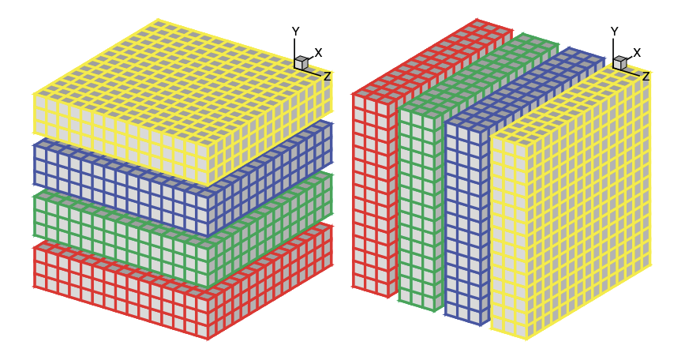

# Incompact3D

It's the incompressible Navier–Stokes equations using sixth-order compact schemes for spatial discretization. It basically implement a ODE with numerical methods called Multistep Methods.

the Poisson equation is fully solved in spectral space using Fast Fourier Transform (FFT) routines


## Intro to the algorithm and implementation




## Test Case Taylor

## Build for MKL/FFTW3
Reminder:

1. Enable MKL speedup on AMD Platform
```cpp
int mkl_serv_intel_cpu_true() {
	return 1;
}
```
2. FFTW3 migrate to CuFFT.

## Reference
1. Incompact3d: A powerful tool to tackle turbulence problems with up to \(O\left(10^{5}\right)\) computational cores