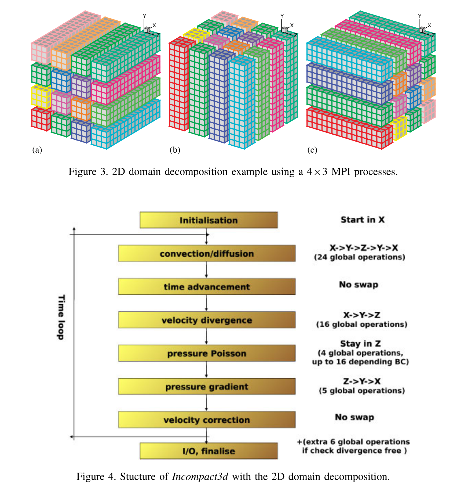

# Incompact3D

It's the incompressible Navier–Stokes equations using sixth-order compact schemes for spatial discretization. It basically implement a ODE with numerical methods called Multistep Methods.

the Poisson equation is fully solved in spectral space using Fast Fourier Transform (FFT) routines


## Intro to the algorithm and implementation




## Test Case Taylor

## Build for MKL/FFTW3
Reminder:

1. Enable MKL speedup on AMD Platform
```cpp
int mkl_serv_intel_cpu_true() {
	return 1;
}
```
2. FFTW3 migrate to CuFFT.

## Build `libnpc` with spack

I don't know why...it fails to build when `MPICXX` is set...

Here is a quick hack

```diff
class Libnbc(AutotoolsPackage):
    """LibNBC is a prototypic implementation of a nonblocking
    interface for MPI collective operations. Based on ANSI C and
    MPI-1, it supports all MPI-1 collective operations in a
    nonblocking manner. LibNBC is distributed under the BSD license.
    """
    homepage = "http://unixer.de/research/nbcoll/libnbc/"
    url      = "http://unixer.de/research/nbcoll/libnbc/libNBC-1.1.1.tar.gz"

    version('1.1.1', sha256='63aa5f75f84c191da0688cb551ebd0e9e46928edfba350b2a534eb0c704dd9c3')

    depends_on("mpi")

+   def configure_args(self):
+       args = []
+       args.append("MPICXX=")
+       return args
```

# Xcompact3d-Preamble and Running Test

* Multiple FFT backend: generic\, fftw\, and intel mkl\.
  * When we use fftw as the FFT backend\, we will get an improvement around 3% on our zen2 cluster\, the performance may be different on other platforms\.
* There is no significant performance difference between mpi and ibv\.
* <span style="color:#181C69">The hotspots of running different examples are rather different\. </span>
  * <span style="color:#181C69">We</span>  <span style="color:#181C69"> </span>  <span style="color:#181C69">will cover this later when we talk about the code structure\.</span>
  * <span style="color:#181C69">We only optimize some part of the source code that are related to problem\. </span>
* <span style="color:#181C69">Tuning parameters works well\.</span>
* <span style="color:#181C69">The MPI workload\(comm ratio\) is high\, especially on Bridges2\.</span>
  * This will be discussed in next few slides\.
* <span style="color:#181C69">When performing the visualization\, IO is critical\(25% of the </span>  <span style="color:#181C69">wall\_time</span>  <span style="color:#181C69">\)\.</span>

| FFT backend | wall_time  |
| :---------: | :--------: |
|   generic   | 353.841614 |
|    fftw3    | 338.326508 |
|     mkl     | 354.947083 |

# Xcompact3d-Profiling

What do the CPU process?


* The program include three module that task much time in the specific input\.
  * Compute turbines
  * Solve Poisson equations
  * Solve the transport equations
* FFT calculations do not take so much time \(in that specific input\)
  * Which explains why the performance difference between FFT implementations are small\.

Profiler: Arm Forge\, Version 21\.1


<span style="color:#000000">The main computation lays in acl\_source\.f90\, and the hotspots are easy to observe\, and we optimize them\.</span>


<span style="color:#000000"> __Further __ </span>  <span style="color:#000000"> __optimizations__ </span>  <span style="color:#000000"> __ will be discussed in Code Challenge\.__ </span>

# Xcompact3d – Parameter Tuning

<span style="color:#181C69"> __In a single node with 64 cores\(number of iterations are modified\): __ </span>

| p_row | p_col | wall_time(s) |
| :---: | :---: | :----------: |
|  32   |   2   |   570.364    |
|  16   |   4   |   543.307    |
|   8   |   8   |   542.956    |
|   4   |  16   |   557.207    |
|   2   |  32   |   579.065    |

<span style="color:#000000">The wall\_time is quite similar\, and so do the MPI proportion\.</span>


<span style="color:#000000">On the two machines\, we breakdown </span>

<span style="color:#000000">512 = 64 \* 8</span>

<span style="color:#000000">160 = 0 \* 0 \(some issues occurred\)</span>

# Xcompact3d – Result Overview


|                      |          Niagara          |         Bridges2          |
| :------------------: | :-----------------------: | :-----------------------: |
|        nodes         | 4 (40 processes per node) | 4(128 processes per node) |
|    wall_time(min)    |         21.40334          |         22.20858          |
| Average time step(s) |         0.5136803         |        0.533005893        |
|                      |                           |                           |

<span style="color:#000000">C</span>  <span style="color:#000000">onsidering the significant different core usage between Niagara and Bridges2\, the performance on bridges2 is not ideal\.</span>


## Reference
1. Incompact3d: A powerful tool to tackle turbulence problems with up to \\(O\left(10^{5}\right)\\) computational cores
