# NWChem
## Overview
### Computational chemistry software
- Input some chemistry stuff and specify the routines, output some density function or energy values.
### Objective: Minimize wall time
- For us without chemistry background, carefully choose libraries, tuning parameters and do some general runtime optimizations (like core binding) should be fine. 
Our work
- Compiled and ran NWChem on both supercomputers successfully.
### Tested various combinations of compilers, MPI and BLAS on both supercomputers.
- Profiled NWChem to understand the GA communication behaviors.
- Tuned the performance by adjusting input files and applying some runtime tricks.

## Performance Tuning

At first, we choose the w5 input of TCE as a performance baseline.

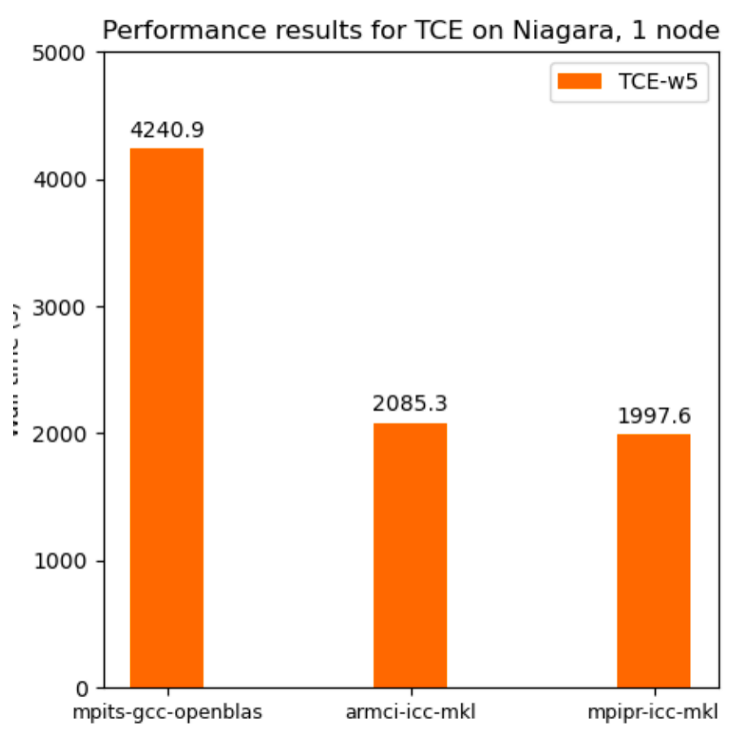

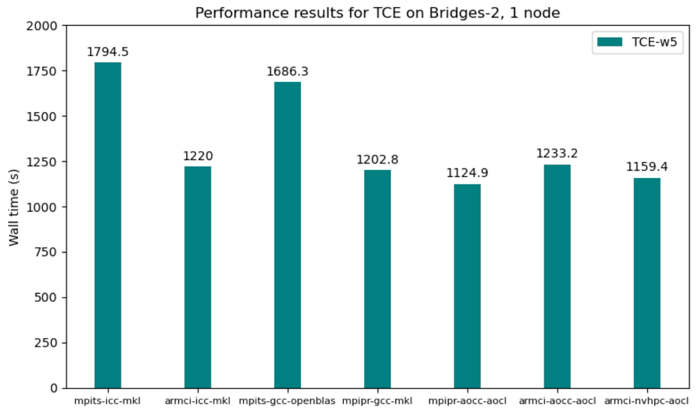

Then we found a fastest configuration for one input is not the fastest for others

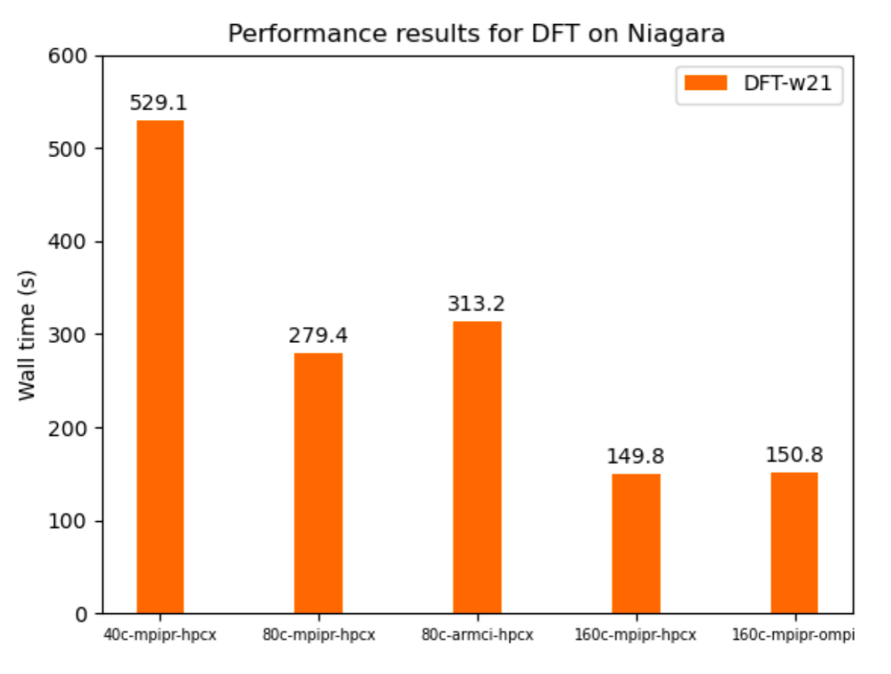

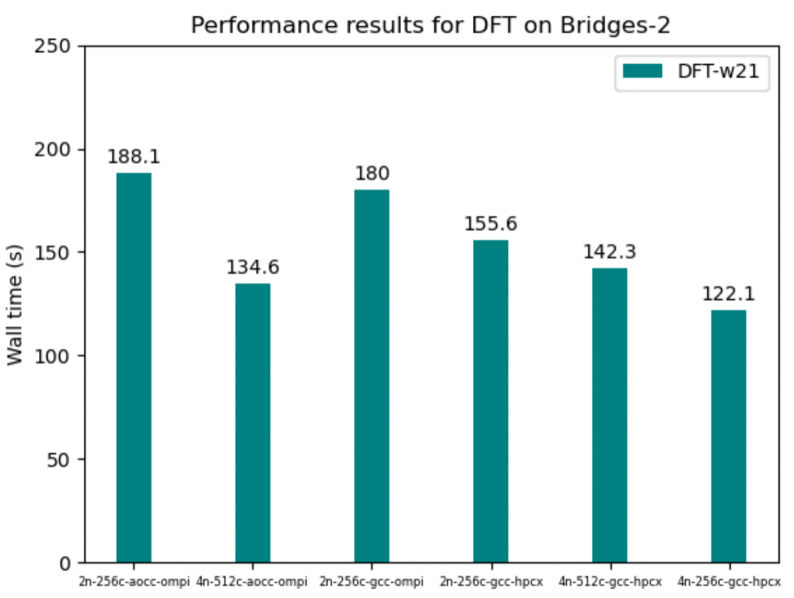

## Solution MPI map by option

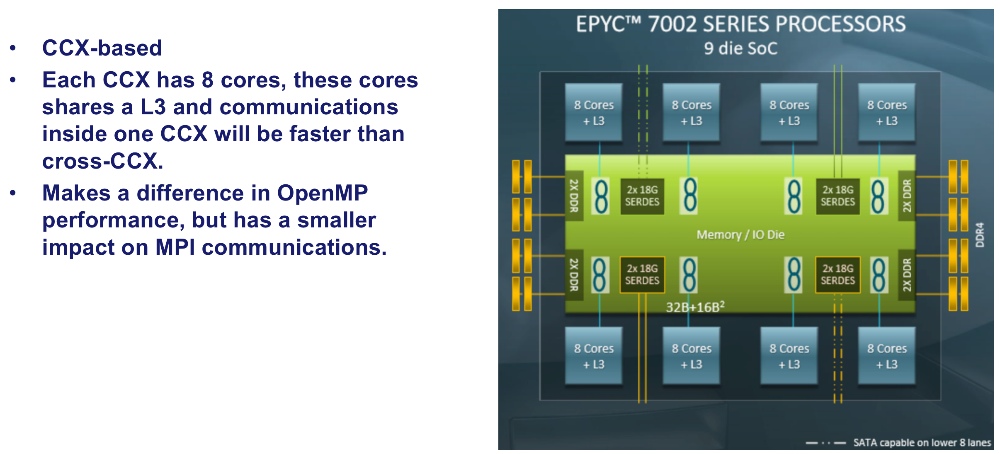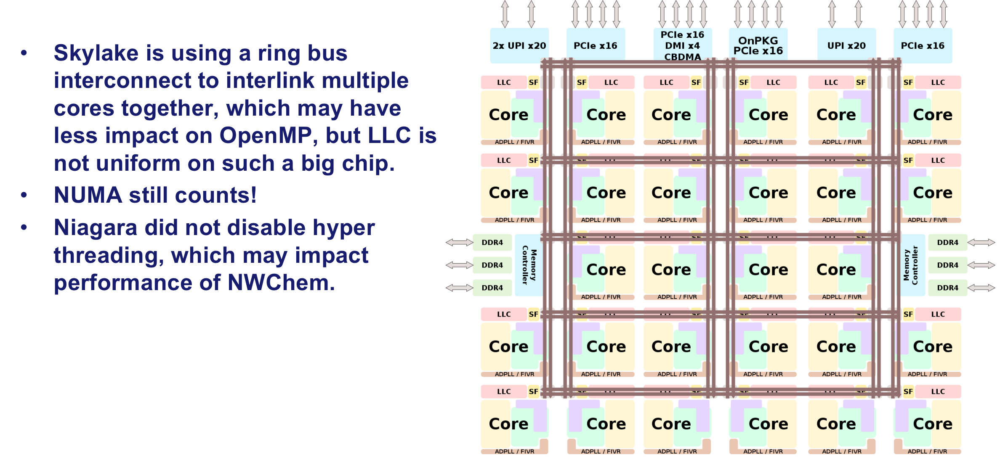

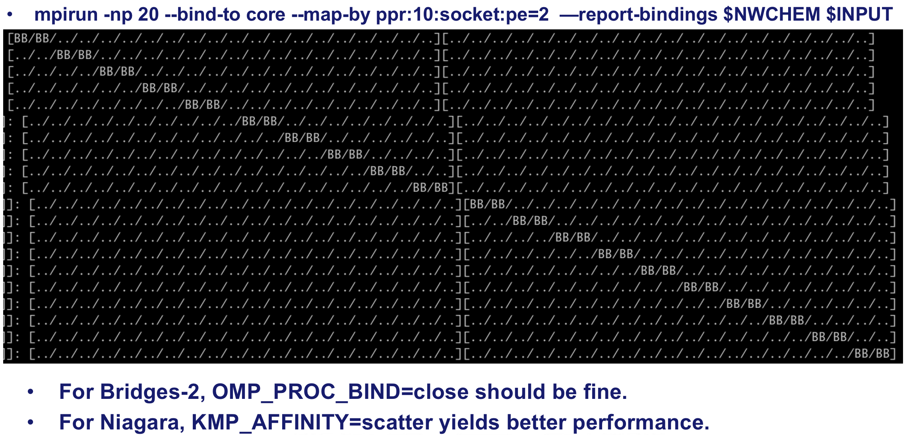

### OMP scaling result

For faster experiments, we skipped many iterations on CCSD by keeping the vector file *.t2

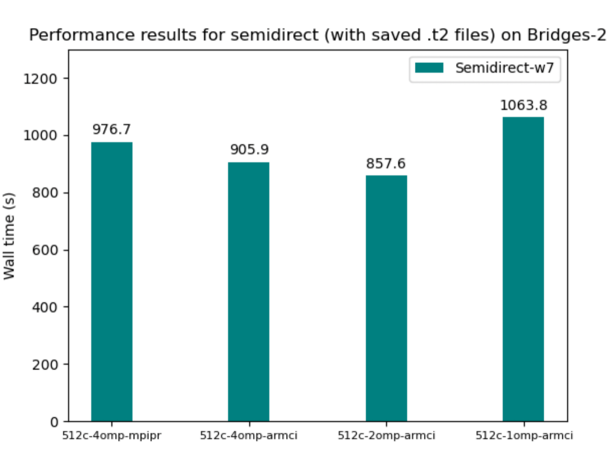

### GPU Acceleration

- On Bridges-2, GPU nodes are using Intel CPUs, we changed the math library to MKL. 
- If our MPI process number exceeds the available GPU devices, GPU performance will decrease significantly. (4 MPI processes -> 20 MPI processes will make GPU performance on CCSD(T) iterations decrease from ~3300GFlops to ~300GFlops).
- To utilize CPU resources when executing the routines without GPU, we should enable OpenMP threading.

### Final result

- There is still some imperfect performance result here. 
- TCE on Bridges-2 spends much time on CCSD iterations.
- Semidirect input on Niagara spends more time on calculating the t2 vectors. 
- For DFT, we used a trick that  runs only half of the cores on 4 nodes, which enables larger L3 caches per core. 

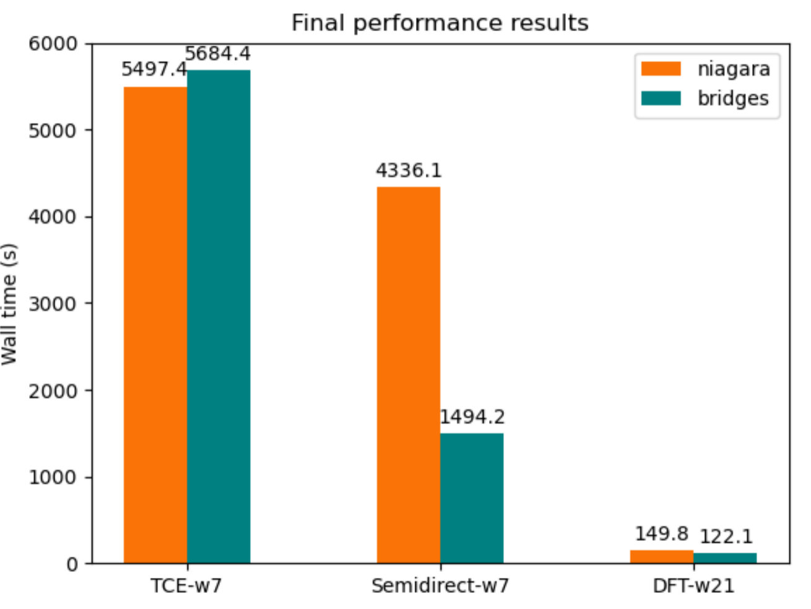

### Profiling result

- Although MPI_Recv consumed the most MPI communication time, the number of calls to MPI_Recv is roughly same to that of MPI_Isend, which is asynchronous and uses less time. 
- The communication pattern of Global Array is mostly send and receive. 

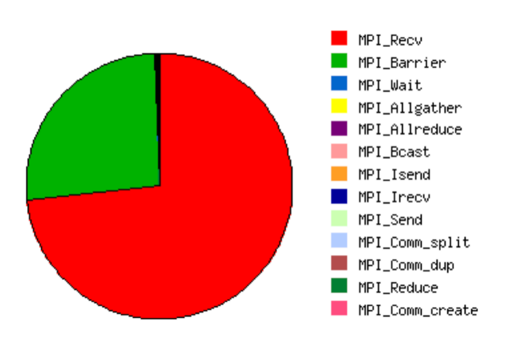

## Difficulties and lesson learnt

- When we test with many compilers, BLAS and MPI libraries, compilation problems, runtime segmentation faults, and out of memory occurs. 

- For example, AOCC’s flang compiler does not support 15 dimension arrays in f08, but some MPI’s mpi.fh has this defined, hence we cannot utilize this combination.

- Sometimes when we try `strange` combinations like compiling NWChem with NVHPC and AOCL, we have linking errors, and I manually link the NWChem binary with -L[shared library containing the missing symbol]
- 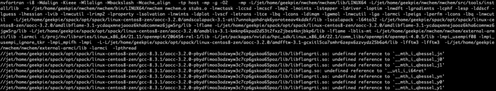

- Choose the suitable libraries for your architecture
  - MKL for Intel, AOCL for AMD, etc
- Multi-node scaling is much harder than shared-memory setting
  - Performance may vary significantly with multi nodes and single node
  - Under some configurations, single node runs faster does not imply that configuration with multi nodes are similarly faster. 
- When MPI cannot get decent scaling result, turn to OpenMP
  - MPI often performs better than OpenMP even on shared-memory systems since the programming paradigm for MPI enforces better data locality and can avoid false sharing. 
  - But when the data size is small compared to the number of cores, set OpenMP thread number to 2 or 4 may outperform pure MPI.
- HPC programming diagram and interface: ARMCI and Global Arrays 
