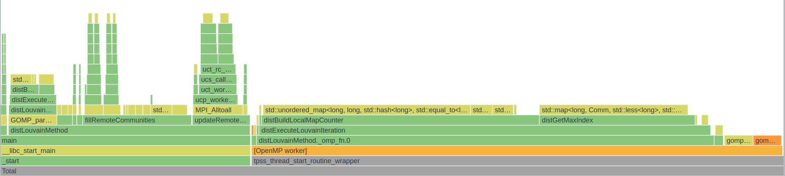
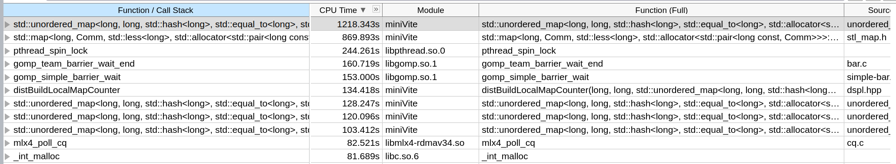
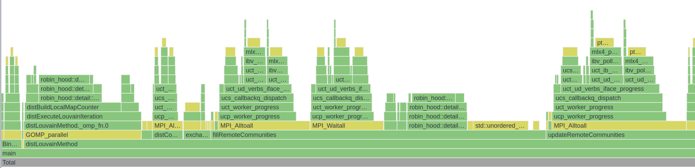

# MiniVite

## 概述

### 资料

[ghosh2018.pdf](minivite/ghosh2018.pdf)
[minivite-indyscc.pdf](minivite-indyscc.pdf)

### 算法

对于每个社区，可以计算 Modularity，整个图的 Modularity 就是每个社区的 Modularity 加总。通过改变社区的划分来影响 Modularity.

目标：最大化 Modularity

Louvain method 是迭代算法，初始每个节点属于自己社区。

对于节点 $u$，考虑每个节点的邻居（有边相连的节点）$v$，将 $u$ 的社区改为 $v$ 的社区会对 Modularity 有一个影响量 $\Delta Q$，$\Delta Q$ 是可以快速计算的。遍历所有邻居以后可以得到一个最大的 $\Delta Q$，如果 $\Delta Q>0$，就将 $u$ 的社区改为 $v$ 的社区。

一个迭代就是考虑一遍所有节点 $u$，当 $\Delta\text{Modularity}<\text{threshold}$ 就停止。

并行化：切分图的节点集合，分给每个计算节点一些图的节点，并行考虑图的节点。

代码比较短，可以阅读

### 编译

可以使用 spack 中的 miniVite, 但是版本比较老，需要改 package.py.

也可以直接用 GitHub 源编译，使用 gcc 可能要把 Makefile 中的 `-xHost` 替换为 `-march=native`，`-qopenmp` 替换为 `-fopenmp`.

https://github.com/ECP-ExaGraph/miniVite

### 运行

摘抄自 README

```
mpiexec -n 2 bin/./minivite -f karate.bin
mpiexec -n 2 bin/./minivite -l -n 100
mpiexec -n 2 bin/./minivite -n 100
mpiexec -n 2 bin/./minivite -p 2 -n 100

[On Cray systems, pass MPICH_MAX_THREAD_SAFETY=multiple or 
pass -DDISABLE_THREAD_MULTIPLE_CHECK while building miniVite.]

Possible options (can be combined):

1. -f <bin-file>   : Specify input binary file after this argument. 
2. -b              : Only valid for real-world inputs. Attempts to distribute approximately 
                     equal number of edges among processes. Irregular number of vertices
                     owned by a particular process. Increases the distributed graph creation
                     time due to serial overheads, but may improve overall execution time.
3. -n <vertices>   : Only valid for synthetically generated inputs. Pass total number of 
                     vertices of the generated graph.
4. -l              : Use distributed LCG for randomly choosing edges. If this option 
                     is not used, we will use C++ random number generator (using 
                     std::default_random_engine).
5. -p <percent>    : Only valid for synthetically generated inputs. Specify percent of overall 
                     edges to be randomly generated between processes.
6. -t <threshold>  : Specify threshold quantity (default: 1.0E-06) used to determine the 
                     exit criteria in an iteration of Louvain method.
7. -w              : Only valid for synthetically generated inputs. Use Euclidean distance as edge weight. 
                     If this option is not used, edge weights are considered as 1.0. Generate 
                     edge weight uniformly between (0,1) if Euclidean distance is not available.                    
8. -r <nranks>     : This is used to control the number of aggregators in MPI I/O and is
                     meaningful when an input binary graph file is passed with option "-f".
                     naggr := (nranks > 1) ? (nprocs/nranks) : nranks;
9. -s              : Print graph data (edge list along with weights).
```

## 作业

### 题目

Access the following server and download the two graph inputs (they are in a binary format).
Server: "sftp indyscc@N/A"
Password: "N/A"

The homework consists of two parts, and each part has two/three questions (checking the appropriate documents from the code repository can save time):

1. Establishing baseline performance:
Download and build the default/main/master branch of miniVite (https://github.com/ECP-ExaGraph/miniVite), run it using the provided com-orkut and webbase-2001 input graphs on  1-20 nodes (to perform strong scaling experiments). Answer the following questions:
How are these two input graphs different?
What arguments did you choose to run miniVite?
Does increasing the number of OpenMP threads help the performance (try 2-3 combinations of threads-per-process, keeping the “processes*threads-per-process” quantity the same)? Why or why not?
2. Performing further optimizations: Find a combination of miniVite arguments and/or macros (arguments are discussed in the README, but for macros, you may need to look elsewhere), in addition to the baseline arguments/options that you ran miniVite with in the previous step, that improves the overall performance and scalability.
Compare baseline performance with the improved version – plot it (X-axis: #Processes(nodes) and Y-axis: “Average total time (in s)” as reported by miniVite), and discuss.
Does your set of options affect the output quality (expressed via modularity and MODS) in any way? If so, discuss.
Submission Instructions
The assignment is assigned to all students. However, a single submission per team is sufficient. One member of the team can submit the assignment.
The report can be a PDF file (preferred method) or a link to a google doc  (we will check the timestamp for when it was last edited).
Please include your team name and the university in the report.

### 修改 Spack 的 package.py

需要加入一些编译选项，故需要修改编译脚本：
```python
# Copyright 2013-2022 Lawrence Livermore National Security, LLC and other
# Spack Project Developers. See the top-level COPYRIGHT file for details.
#
# SPDX-License-Identifier: (Apache-2.0 OR MIT)
from spack.package import *
class Minivite(MakefilePackage):
    """miniVite is a proxy application that implements a single phase of
    Louvain method in distributed memory for graph community detection.
    """
    tags = ["proxy-app", "ecp-proxy-app"]
    homepage = "https://hpc.pnl.gov/people/hala/grappolo.html"
    git = "https://github.com/Exa-Graph/miniVite.git"
    version("develop", branch="master")
    version("1.0", tag="v1.0")
    version("1.1", tag="v1.1")
    variant("openmp", default=True, description="Build with OpenMP support")
    variant("opt", default=True, description="Optimization flags")
    variant("mode",default='default',description="mode",values=('collective','sendrecv','rma','default','rma_accu'))
    variant("omp_schedule", default=False, description="Enable OMP schedule")
    variant("use_32_bit_graph", default=False, description="Use 32bit graph")
    depends_on("mpi")
    @property
    def build_targets(self):
        targets = []
        cxxflags = ["-std=c++11 -g -DCHECK_NUM_EDGES -DPRINT_EXTRA_NEDGES"]
        ldflags = []
        if "+openmp" in self.spec:
            cxxflags.append(self.compiler.openmp_flag)
            ldflags.append(self.compiler.openmp_flag)
        if "+opt" in self.spec:
            cxxflags.append(" -O3 ")
        if self.spec.variants['mode'].value == 'collective':
            cxxflags.append("-DUSE_MPI_COLLECTIVES")
        elif self.spec.variants['mode'].value == 'sendrecv':
            cxxflags.append("-DUSE_MPI_SENDRECV")
        elif self.spec.variants['mode'].value == 'rma':
            cxxflags.append("-DUSE_MPI_RMA")
        elif self.spec.variants['mode'].value == 'rma_accu':
            cxxflags.append("-DUSE_MPI_RMA -DUSE_MPI_ACCUMULATE ")
        if "+omp_schedule" in self.spec:
            cxxflags.append("-DOMP_SCHEDULE_RUNTIME")
        if "+use_32_bit_graph" in self.spec:
            cxxflags.append("-DUSE_32_BIT_GRAPH")
        targets.append("CXXFLAGS={0}".format(" ".join(cxxflags)))
        targets.append("OPTFLAGS={0}".format(" ".join(ldflags)))
        targets.append("CXX={0}".format(self.spec["mpi"].mpicxx))
        return targets
    # 下面省略
```

本道题目在启用 `USE_MPI_RMA` 后，性能获得较大提升。

### 报告

[minivite.pdf](minivite.pdf)

### 评价

- As a response to the first question, why do you think orkut's running time is longer even though it is smaller in size compared to webbase?
- How many OpenMP threads per process for the baseline strong scaling experiments?
- In part 1, you provide a brief discussion on observed load imbalance. But, you do not mention how you mitigated it in part 2.
- It would have been interesting to modulate the threshold and measure the effect on performance, and check the impact on MODS

3/5 + 5/5 + 30/40 + 25/25 + 18/25 = 81/100

## Final

### 题目

This assignment has two parts, strong scale and weak scale. Like in homework #1, you will download and build miniVite: https://github.com/ECP-ExaGraph/miniVite
 
#### Strong scale

Use the com-friendster graph as input to miniVite, and the optimization arguments that you learned about during the last homework to perform strong scaling experiments (any option that improves the performance is acceptable, even if quality in terms of modularity is affected somewhat).

For this input, there will be startup issues (out-of-memory related crash or slowness) if you use a relatively small #nodes to begin or limited optimization arguments.

The goal of this exercise is to find a set of arguments and options (which may differ among process configurations) that maximizes strong scalability for this input, without compromising quality/modularity too much (rounding off final modularity to the first decimal place should yield similar values no matter your choice of optimizations). (Don’t try to use -DDUSE_32BIT_GRAPH, it won’t work)

i.
Pick x where x is the startup node, and then scale the #nodes by incrementing x by a fixed stride to get the next process/node configuration, continue until x == 20.
(pick any combination of processes-per-node and threads-per-process that yields better performance)
You can vary processes-per-node as you see fit.
How did you pick the base x?

ii.
Report graph loading/construction times, #iterations to convergence, the time to perform the Louvain graph clustering as reported by miniVite running on the nodes as per 1.a.i.

Also, mention the arguments that you passed to miniVite and options you build it with.

#### Weak scale

Use the miniVite options to generate a distributed input graph (see FAQs and README) that scales with the #processes.
Pick a reasonable number of vertices (this is governed by a formula – see FAQ, if miniVite complains, just adjust the #vertices or #processes)

i.
Start with 1 node (any #processes-per-node and #threads-per-process configuration that makes sense to you) and end at 20 nodes.
Plot the time to generate the graph, time to perform graph clustering (using data returned by miniVite) on 1-20 nodes. 

ii.
How large is the graph you generated on 20 nodes vs. 1 node?
(Larger is better, but too large will take too much time in graph generation).

For submission, Create two directories called weak_scale and strong_scale and put the documents that answers the questions for each category in their respective directories.

### 题目分析

1. Strong scaling, 即固定问题规模，增加并行数量，减少运行时间。理想情况是 $\text{time with \(n\) nodes}=\frac{\text{time with 1 node}}{\text{number of nodes}}$
2. Weak scaling，即固定每个并行节点的运算量，增加并行数量（问题规模同时增加）。理想情况是运行时间不变（没有任何并行带来的额外开销）。

### OpenMPI & OpenMP 调参

每个机器是 2 个 E5-2660 v3，总共 20 cores.

经过一些尝试，OpenMP 开单线程，MPI 开到 20 效果最好。

|   PPN |   OMP_NUM_THREADS |   Clustering |
|------:|------------------:|------------------:|
|    20 |                 1 |           100.445 |
|    20 |                 2 |           102.023 |
|    20 |                 4 |           108.56  |
|    12 |                 3 |           132.041 |
|    10 |                 2 |           146.281 |

似乎表明 OpenMP 并行效果不如 MPI，可能是 OpenMP atomic 开销太大，但是没有做过 profiling 不能确定。
每个 MPI 进程都会开一个数据结构存储全图所有节点的信息，内存开销大。

```
mpirun --hostfile ./hostfile -n 400 -map-by core --bind-to core miniVite -f com-friendster.ungraph.bin -b -t 0.0015
```

### Profile

原程序用的 `std::set` `std::map` `std::unordered_set` `std::unordered_map` 太慢了，换成第三方快速 HashTable 实现能加速很多倍。
原算法开了一个不必要的 `vector` 也可以优化掉。





### Weak scale

用 miniVite 自带的算法生成图，生成非常慢，而且进程个数必须是 $2^n$，导致只能跑进程数 $1,2,4,8,16,32,64,128,256$。
没有用 oversubscribing 因为不太符合 weak scaling 的意思，而且跑出来数据可能会很难看（指波动大）。

### 提交

[strong-scale-report.pdf](minivite/strong-scale-report.pdf)
[weak-scale-report.pdf](minivite/weak-scale-report.pdf)
[0001-modify.patch](minivite/0001-modify.patch)