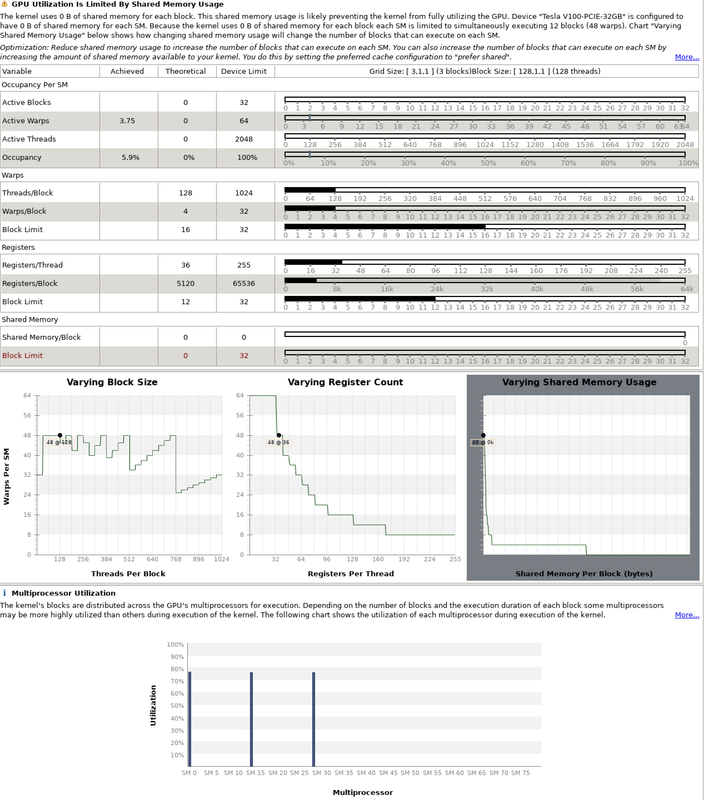

# Quantum Espresso

https://github.com/QEF/q-e

### compile

Could not find MPI (Missing MPI_FORTRAN_FOUND)

solve:  `-DMPIEXEC_EXECTUABLE=${MPI_HOME}/bin/mpiexec`

The compiled version does not support OpenMP and only support up to 4 processes for MPI.

Add the options: 

`-DQE_ENABLE_OPENMP=ON`
`-DCMAKE_Fortran_COMPILER=${MPI_HOME}/bin/mpifort`
`-DOpenMP_C_FLAGS=-fopenmp=lomp`
`-DOpenMP_CXX_FLAGS=-fopenmp=lomp`
`-DOpenMP_C_LIB_NAMES=libomp`
`-DOpenMP_CXXLIB_NAMES=libomp`
`-DOpenMP_libomp_LIBRARY=/usr/lib/x86_64-linux-gnu/libomp.so.5`

Change Toolchain to `System`.

Add `-g` to `CMakeList.txt` to get additional debug information.

`set(CMAKE_CXX_FLAGS -g)`
`set(CMAKE_C_FLAGS -g)`
`set(CMAKE_Fortran_FLAGS -g)`

https://www.quantum-espresso.org/Doc/user_guide/

library configure: https://www.quantum-espresso.org/Doc/user_guide/node11.html

### test

In directory `/q-e/test-suite/`, use `make run-tests` to test the correctness of basic functionalities. 

### run

`spack load ucx/gji`

`/home/qe/q-e/bin/pw.x`

To control the number of processors in each group, command line switches: -nimage, -npools, -nband, -ntg, -ndiag or -northo (shorthands, respectively: -ni, -nk, -nb, -nt, -nd) are used. As an example consider the following command line:
`mpirun -np 4096 ./neb.x -ni 8 -nk 2 -nt 4 -nd 144 -i my.input` This executes a NEB calculation on 4096 processors, 8 images (points in the configuration space in this case) at the same time, each of which is distributed across 512 processors. k-points are distributed across 2 pools of 256 processors each, 3D FFT is performed using 4 task groups (64 processors each, so the 3D real-space grid is cut into 64 slices), and the diagonalization of the subspace Hamiltonian is distributed to a square grid of 144 processors (12x12).

`mpirun -np 24 -x PATH --oversubscribe -x OMP_NUM_THREADS=4 -x LD_LIBRARY_PATH=/opt/nonspack/ucx-1.10.0-gcc/lib --allow-run-as-root /home/qe/q-e/bin/pw.x < ./ausurf.in`

First run with 24 processes and 4 thread each: 


Problem: OMP threads can only use up to 200% CPU per process even with 256 threads per process. 

### Analyze

#### Static Analysis
Using lizard

Fortran: 

    Total nloc  Avg.NLOC  AvgCCN  Avg.token  Fun Cnt  Warning cnt  Fun Rt  nloc Rt
    599949      54.1      10.6    569.7      9939     1693         0.17    0.58

C:

    Total nloc  Avg.NLOC  AvgCCN  Avg.token  Fun Cnt  Warning cnt  Fun Rt  nloc Rt
    52039       152.5     3.0     1050.3     323      19           0.06    0.53

Python:

    Total nloc  Avg.NLOC  AvgCCN  Avg.token  Fun Cnt  Warning cnt  Fun Rt  nloc Rt
    8864        18.3      5.0     146.0      298      21           0.07    0.26

#### Profiling result
All the GPU versionn test case seems to have IEEE underflow, trigger by the FFTlib, which should be fixed. Since the developing team of this project still aggressively develop the application to tailor to GPU. 

We chose to use a case called si.scf.david.in to profile on single GPU. And here's the profiling result.

```bash
=117847== Profiling application: /home/qe/bin/pw.x -i ./si.scf.david.in
==117847== Profiling result:
            Type  Time(%)      Time     Calls       Avg       Min       Max  Name
 GPU activities:    8.72%  22.118ms       140  157.98us  157.82us  159.81us  usnldiag_collinear_79_gpu
                    6.46%  16.390ms      1360  12.051us  11.840us  189.41us  init_us_2_base_gpu_216_gpu
                    5.29%  13.411ms        10  1.3411ms  1.3407ms  1.3417ms  rotate_wfc_k_gpu_146_gpu
                    4.24%  10.763ms       370  29.090us  28.704us  32.928us  ylmr2_gpum_ylmr2_gpu_kernel_
                    3.71%  9.4250ms      1127  8.3620us  6.5280us  17.664us  volta_zgemm_32x32_nn
                    3.23%  8.1880ms      1224  6.6890us  6.5920us  7.1040us  init_us_2_base_gpu_220_gpu
                    2.68%  6.8026ms       680  10.003us  9.8560us  10.784us  init_us_2_base_gpu_185_gpu
                    2.67%  6.7818ms       340  19.946us  19.744us  21.280us  init_us_2_base_gpu_206_gpu
                    2.61%  6.6090ms       340  19.438us  19.295us  21.504us  init_us_2_base_gpu_158_gpu
                    2.46%  6.2396ms       689  9.0560us  7.2000us  14.432us  void zgemm_largek_warp<bool=1, bool=0, bool=1, bool=0, int=3, int=3, int=4, int=3, int=2, int=2, int=9>(double2*, double2 const *, double2 const *, int, int, int, int, int, int, double2 const *, double2 const *, double2, double2, int, int, int*, int*)
                    2.28%  5.7953ms       159  36.448us  19.392us  43.200us  cegterg_gpu_493_gpu
                    2.20%  5.5704ms      1104  5.0450us  4.1600us  11.488us  void composite_2way_fft<unsigned int=20, unsigned int=4, unsigned int=32, padding_t=0, twiddle_t=0, loadstore_modifier_t=2, unsigned int=5, layout_t=1, unsigned int, double>(kernel_arguments_t<unsigned int>)
                    2.17%  5.4956ms       478  11.497us  11.359us  12.864us  add_vuspsi_k_gpu_242_gpu
                    1.98%  5.0265ms       239  21.031us  10.208us  40.384us  vloc_psi_k_gpu_464_gpu
                    1.86%  4.7254ms       219  21.577us  12.319us  33.824us  void sytd2_upper_cta<double2, double, int=4>(int, double2*, unsigned long, double*, double*, double2*)
                    1.71%  4.3307ms       219  19.774us  19.743us  20.960us  laxlib_cdiaghg_gpu_349_gpu
                    1.64%  4.1660ms       239  17.430us  17.248us  19.488us  vloc_psi_k_gpu_477_gpu
                    1.48%  3.7585ms         1  3.7585ms  3.7585ms  3.7585ms  force_corr_gpu_103_gpu
                    1.45%  3.6914ms       239  15.444us  15.264us  16.704us  vloc_psi_k_gpu_456_gpu
                    1.40%  3.5579ms      2320  1.5330us  1.4080us  13.056us  [CUDA memcpy DtoH]
                    1.36%  3.4570ms       219  15.785us  15.712us  16.352us  laxlib_cdiaghg_gpu_317_gpu
                    1.34%  3.4099ms       159  21.445us  21.280us  23.136us  g_psi_gpu_53_gpu
                    1.28%  3.2424ms      1979  1.6380us  1.2160us  13.120us  [CUDA memcpy HtoD]
                    1.22%  3.0915ms       552  5.6000us  4.2880us  9.0560us  void composite_2way_fft<unsigned int=20, unsigned int=4, unsigned int=16, padding_t=0, twiddle_t=0, loadstore_modifier_t=2, unsigned int=5, layout_t=0, unsigned int, double>(kernel_arguments_t<unsigned int>)
                    1.19%  3.0239ms       239  12.652us  10.816us  14.240us  h_psi__gpu_158_gpu
                    1.14%  2.8893ms       219  13.193us  9.2160us  20.192us  void trsm_ln_up_kernel<double2, unsigned int=32, unsigned int=32, unsigned int=4, bool=0>(int, int, double2 const *, int, double2*, int, double2, double2 const *, int, int*)
                    1.12%  2.8463ms      1095  2.5990us  2.4960us  3.2640us  copy_info_kernel(int, int*)
                    1.06%  2.6975ms       170  15.867us  15.647us  16.544us  init_us_2_base_gpu_119_gpu
                    1.02%  2.5845ms        40  64.612us  64.320us  72.960us  stres_us_k_gpu_702_gpu
                    1.01%  2.5699ms       159  16.162us  16.096us  16.704us  reorder_evals_cevecs_707_gpu
                    0.99%  2.5005ms        40  62.512us  62.240us  70.656us  stres_us_k_gpu_817_gpu
                    0.97%  2.4644ms       159  15.499us  15.232us  16.576us  cegterg_gpu_427_gpu
                    0.96%  2.4360ms        70  34.799us  34.720us  35.424us  cegterg_gpu_265_gpu
                    0.89%  2.2453ms        40  56.131us  55.840us  63.040us  stres_knl_gpu_100_gpu
                    0.86%  2.1855ms        40  54.636us  54.463us  56.832us  stres_us_k_gpu_543_gpu
                    0.82%  2.0773ms       243  8.5480us  7.2320us  11.904us  fft_scalar_cufft_cfft3d_gpu_586_gpu
                    0.82%  2.0749ms       280  7.4100us  7.3280us  7.8720us  get_rho_gpu_954_gpu
                    0.80%  2.0350ms       212  9.5990us  9.4080us  10.016us  dp_dev_memcpy_c2d_770_gpu
                    0.71%  1.7922ms       689  2.6010us  2.4960us  3.7440us  void scal_kernel<double2, double2, int=1, bool=1, int=5, int=4, int=4, int=4>(cublasTransposeParams<double2>, double2 const *, double2*, double2 const *)
                    0.70%  1.7640ms       159  11.094us  10.912us  11.744us  cegterg_gpu_376_gpu
                    0.67%  1.7032ms       508  3.3520us  3.1670us  4.4480us  void reduce_1Block_kernel<double, int=128, int=7, cublasGemvTensorStridedBatched<double>, cublasGemvTensorStridedBatched<double>, cublasGemvTensorStridedBatched<double>>(double const *, double, double, int, double const *, double, cublasGemvTensorStridedBatched<double>, cublasGemvTensorStridedBatched<double>, cublasPointerMode_t, cublasLtEpilogue_t, cublasGemvTensorStridedBatched<biasType<cublasGemvTensorStridedBatched<double>::value_type, double>::type const >)
                    0.67%  1.7000ms       508  3.3460us  3.1680us  4.8640us  void dot_kernel<double, int=128, int=0, cublasDotParams<cublasGemvTensor<double const >, cublasGemvTensorStridedBatched<double>>>(double const )
                    0.66%  1.6738ms        40  41.843us  41.760us  42.944us  stres_us_k_gpu_617_gpu
                    0.66%  1.6658ms       159  10.476us  10.432us  11.136us  reorder_evals_cevecs_700_gpu
                    0.54%  1.3789ms       219  6.2960us  5.1840us  8.9280us  void potrf_alg2_cta_upper<double2, double, int=32>(int, int, double2*, unsigned long, int*)
                    0.53%  1.3506ms       170  7.9440us  7.8400us  8.6080us  init_us_2_base_gpu_134_gpu
                    0.53%  1.3341ms       438  3.0450us  2.4960us  188.80us  void lapack_identity_kernel<double, int=8>(int, int, double*, int)
                    0.52%  1.3279ms       219  6.0630us  5.0880us  8.6400us  void trsm_right_kernel<double2, int=256, int=4, bool=0, bool=0, bool=0, bool=1, bool=0>(cublasTrsmParams<double2>, double2, double2 const *, int)
                    0.52%  1.3185ms       219  6.0200us  4.3200us  8.2880us  void ormql_cta_kernel<double2, int=4, int=1>(int, int, int, double2 const *, unsigned long, double2 const *, double2*, unsigned long, int, int, int, int)
                    0.52%  1.3185ms        90  14.649us  14.496us  15.072us  dylmr2_gpu_78_gpu
                    0.51%  1.2925ms       209  6.1840us  6.1440us  6.4640us  dp_dev_memcpy_r1d_270_gpu
                    0.50%  1.2803ms        71  18.033us  17.983us  18.687us  cegterg_gpu_615_gpu
                    0.50%  1.2592ms       438  2.8740us  2.7200us  3.8720us  void kernel_extract_uplo_A<double2, int=5, int=3>(int, double2 const *, unsigned long, double2*, unsigned long, int)
                    0.50%  1.2586ms       163  7.7210us  7.5840us  8.0000us  dp_dev_memset_c2d_1851_gpu
                    0.47%  1.1830ms       408  2.8990us  2.4960us  3.7440us  __pgi_dev_cumemset_16n
                    0.47%  1.1818ms        80  14.772us  14.496us  17.216us  g2_kin_gpu_40_gpu
                    0.44%  1.1150ms       169  6.5970us  5.6960us  9.1200us  void trsm_left_kernel<double2, int=256, int=4, bool=0, bool=1, bool=1, bool=1, bool=0>(cublasTrsmParams<double2>, double2, double2 const *, int)
                    0.42%  1.0619ms        52  20.420us  18.944us  27.136us  volta_zgemm_32x32_cn
                    0.42%  1.0610ms        70  15.157us  15.104us  16.032us  sum_band_k_gpu_837_gpu
                    0.40%  1.0224ms       219  4.6680us  4.2240us  5.4720us  void lansy_M_stage1<double2, double, int=8>(int, double2 const *, unsigned long, double*, int)
                    0.40%  1.0046ms        90  11.162us  11.040us  11.488us  dylmr2_gpu_90_gpu
                    0.39%  984.57us        80  12.307us  12.223us  12.928us  atomic_wfc___gpu_396_gpu
                    0.37%  946.72us        80  11.833us  11.744us  12.224us  compute_deff_gpu_41_gpu
                    0.36%  909.82us       689  1.3200us  1.2480us  2.0160us  [CUDA memset]
                    0.34%  856.35us       219  3.9100us  3.8080us  5.6000us  void batch_symmetrize_kernel<double2, int=5, int=3>(int, double2*, unsigned long, __int64, int, int)
                    0.34%  855.00us        30  28.500us  28.352us  29.568us  gen_us_dy_gpu_229_gpu
                    0.33%  842.37us        90  9.3590us  9.2480us  9.8240us  dylmr2_gpu_101_gpu
                    0.33%  827.00us        90  9.1880us  9.0230us  10.048us  dylmr2_gpu_60_gpu
                    0.30%  772.22us       219  3.5260us  3.4870us  4.8000us  void lansy_M_stage2<double, int=8>(int, double*)
                    0.29%  745.95us        30  24.865us  24.831us  25.120us  gen_us_dy_gpu_198_gpu
                    0.28%  703.80us        30  23.460us  23.423us  24.128us  gen_us_dy_gpu_146_gpu
                    0.27%  690.78us       219  3.1540us  3.0720us  3.7120us  void lapack_lacpy_kernel<double, int=8>(int, int, double const *, int, double*, int, int, int)
                    0.27%  685.82us       219  3.1310us  3.0390us  3.6480us  void laed0_phase1_kernel<double, int=8>(int, double const *, int, int const *, double*, int, int, int)
                    0.25%  644.64us       219  2.9430us  2.8800us  3.9040us  void stedcx_convert_kernel<double2, double, int=8>(int, int, double const *, int, double2*, int)
                    0.25%  642.30us       219  2.9320us  2.8800us  3.2960us  void lacpy_kernel<double2, double2, int=5, int=3>(int, int, double2 const *, unsigned long, double2*, unsigned long, int, int)
                    0.25%  623.36us       219  2.8460us  2.8150us  3.2000us  potrf_alg2_reset_info(int*)
                    0.24%  598.37us       219  2.7320us  2.6880us  2.8800us  dtrsv_init_up(int*, int)
                    0.24%  596.93us       219  2.7250us  2.6880us  3.2320us  potrf_alg2_set_info(int, int, int*)
                    0.22%  558.62us        30  18.620us  18.432us  18.911us  gen_us_dy_gpu_85_gpu
                    0.21%  525.28us        70  7.5030us  7.4560us  7.6160us  diag_bands_k_693_gpu
                    0.18%  457.21us        30  15.240us  15.136us  15.968us  force_us_gpu_104_gpu
                    0.18%  456.89us        50  9.1370us  8.9910us  14.144us  void trsm_lt_up_kernel<double2, unsigned int=32, unsigned int=32, unsigned int=4, bool=0, bool=1>(int, int, double2 const *, int, double2*, int, double2, double2 const *, int, int*)
                    0.18%  454.24us        30  15.141us  15.040us  17.024us  gen_us_dy_gpu_185_gpu
                    0.18%  453.47us        70  6.4780us  6.4320us  6.7520us  dp_dev_memset_r2d_1431_gpu
                    0.17%  437.12us        20  21.856us  21.632us  23.712us  atomic_wfc_gpu_108_gpu
                    0.17%  427.58us        20  21.379us  20.992us  23.104us  interp_atwfc_gpu_30_gpu
                    0.15%  381.34us        30  12.711us  12.608us  13.184us  gen_us_dy_gpu_102_gpu
                    0.14%  362.69us        60  6.0440us  5.9510us  6.2720us  gen_us_dy_gpu_220_gpu
                    0.13%  334.53us        78  4.2880us  3.9040us  5.5360us  void gemv2N_kernel<int, int, double2, double2, double2, double2, int=128, int=16, int=4, int=4, int=1, bool=0, cublasGemvParams<cublasGemvTensorStridedBatched<double2 const >, cublasGemvTensorStridedBatched<double2 const >, cublasGemvTensorStridedBatched<double2>, double2>>(double2 const )
                    0.12%  298.91us         1  298.91us  298.91us  298.91us  compute_dvloc_gpum_compute_dvloc_gpu_
                    0.10%  255.07us        10  25.507us  25.280us  27.392us  gen_us_dj_gpu_206_gpu
                    0.10%  248.74us        10  24.873us  24.800us  25.216us  gen_us_dj_gpu_173_gpu
                    0.10%  243.93us        10  24.393us  24.256us  25.440us  gen_us_dj_gpu_119_gpu
                    0.08%  204.67us        30  6.8220us  6.7520us  6.9760us  gen_us_dy_gpu_112_gpu
                    0.08%  198.24us        52  3.8120us  3.5520us  4.9280us  void splitKreduce_kernel<double2, double2, double2, double2>(cublasSplitKParams<double2>, double2 const *, double2 const *, double2*, double2 const *, double2 const *, double2 const *)
                    0.08%  197.82us        52  3.8040us  3.6480us  4.7040us  void gemvNSP_kernel<double2, double2, double2, double2, int=1, int=32, int=4, int=1024, cublasGemvParams<cublasGemvTensorStridedBatched<double2 const >, cublasGemvTensorStridedBatched<double2 const >, cublasGemvTensorStridedBatched<double2>, double2>>(double2 const )
                    0.08%  194.37us        10  19.436us  19.072us  20.832us  init_wfc_gpu_295_gpu
                    0.07%  186.46us        10  18.646us  18.592us  18.816us  gen_us_dj_gpu_73_gpu
                    0.07%  182.18us        10  18.217us  18.176us  18.399us  stres_knl_gpu_84_gpu
                    0.07%  173.02us        20  8.6510us  8.6400us  8.8320us  cegterg_gpu_288_gpu
                    0.07%  172.42us        20  8.6200us  8.5120us  9.0560us  stres_us_gpu_131_gpu
                    0.07%  171.01us        10  17.100us  17.024us  17.376us  atomic_wfc_gpu_70_gpu
                    0.06%  152.13us        10  15.212us  15.071us  16.384us  gen_us_dj_gpu_160_gpu
                    0.05%  137.73us        50  2.7540us  2.7200us  2.9760us  dtrsv_init(int*)
                    0.05%  135.39us         2  67.695us  64.959us  70.432us  force_corr_gpu_124_gpu
                    0.05%  123.78us        20  6.1880us  5.8880us  6.7520us  void gemv2T_kernel_val<int, int, double2, double2, double2, double2, int=128, int=16, int=4, int=4, bool=1, bool=0, cublasGemvParams<cublasGemvTensorStridedBatched<double2 const >, cublasGemvTensorStridedBatched<double2 const >, cublasGemvTensorStridedBatched<double2>, double2>>(double2 const , double2, double2)
                    0.05%  120.93us        20  6.0460us  5.9520us  6.3680us  gen_us_dj_gpu_197_gpu
                    0.04%  103.62us        10  10.361us  10.304us  10.848us  stres_us_gpu_91_gpu
                    0.04%  96.448us         7  13.778us  13.568us  14.176us  dfunct_gpum_newd_gpu_311_gpu
                    0.04%  94.400us         1  94.400us  94.400us  94.400us  stres_ewa_gpu_155_gpu
                    0.03%  72.992us        10  7.2990us  7.1360us  8.4160us  init_wfc_gpu_391_gpu
                    0.03%  72.800us         2  36.400us  34.432us  38.368us  force_lc_gpu_119_gpu
                    0.03%  72.768us         1  72.768us  72.768us  72.768us  stres_har_gpu_77_gpu
                    0.03%  69.888us        10  6.9880us  6.8480us  7.4240us  atomic_wfc_gpu_85_gpu
                    0.03%  67.520us         1  67.520us  67.520us  67.520us  stres_loc_gpu_155_gpu
                    0.02%  59.712us        10  5.9710us  5.8880us  6.2080us  rotate_wfc_k_gpu_132_gpu
                    0.01%  24.384us         6  4.0640us  3.7760us  4.9600us  void reduce_1Block_kernel<double2, int=64, int=6, cublasGemvTensorStridedBatched<double2>, cublasGemvTensorStridedBatched<double2 const >, cublasGemvTensorStridedBatched<double2>>(double2 const *, double2, double2, int, double2 const *, double2, cublasGemvTensorStridedBatched<double2>, double2 const , cublasPointerMode_t, cublasLtEpilogue_t, cublasGemvTensorStridedBatched<biasType<double2 const value_type, double2>::type const >)
                    0.01%  24.224us         6  4.0370us  3.7760us  4.8960us  void dot_kernel<double2, int=64, int=1, cublasDotParams<cublasGemvTensorStridedBatched<double2 const >, cublasGemvTensorStridedBatched<double2>>>(double2 const )
                    0.01%  21.568us         1  21.568us  21.568us  21.568us  stres_loc_gpu_98_gpu
                    0.01%  15.264us         6  2.5440us  2.4640us  2.8160us  __pgi_dev_cumemset_4n
                    0.00%  9.7280us         1  9.7280us  9.7280us  9.7280us  dvloc_of_g_gpu_184_gpu
      API calls:   56.54%  877.99ms      1715  511.95us     489ns  409.99ms  cudaFree
                   19.84%  308.14ms       900  342.37us  1.4400us  295.87ms  cudaDeviceSynchronize
                    7.03%  109.13ms     20152  5.4150us  4.5100us  310.44us  cudaLaunchKernel
                    4.31%  66.931ms      1542  43.405us  4.6000us  3.8148ms  cudaMemcpy
                    2.19%  34.061ms      2479  13.739us  3.8100us  180.48us  cudaMemcpyAsync
                    2.12%  32.959ms      2557  12.889us  4.6510us  239.27us  cudaEventSynchronize
                    1.43%  22.244ms        20  1.1122ms  822.92us  2.3907ms  cuDeviceTotalMem
                    1.11%  17.296ms      6645  2.6020us     749ns  186.38us  cudaEventRecord
                    0.93%  14.380ms      1744  8.2450us  1.8290us  1.3001ms  cudaMalloc
                    0.75%  11.621ms      1977  5.8780us     149ns  1.6835ms  cuDeviceGetAttribute
                    0.57%  8.8800ms     20143     440ns     330ns  287.69us  cudaDeviceGetAttribute
                    0.49%  7.6111ms      1656  4.5960us  4.0700us  31.689us  cuLaunchKernel
                    0.33%  5.1501ms     10579     486ns     330ns  239.62us  cudaGetDevice
                    0.29%  4.4656ms         6  744.27us  448.31us  2.1013ms  cudaGetDeviceProperties
                    0.28%  4.4199ms     10835     407ns     150ns  2.2176ms  cudaGetLastError
                    0.25%  3.8660ms      1384  2.7930us  1.8200us  8.4200us  cudaStreamSynchronize
                    0.20%  3.1513ms       689  4.5730us  3.3890us  20.390us  cudaMemsetAsync
                    0.19%  3.0171ms      2557  1.1790us  1.0100us  11.680us  cudaEventElapsedTime
                    0.15%  2.3771ms       256  9.2850us  1.9900us  152.75us  cudaSetDevice
                    0.15%  2.2786ms      1524  1.4950us     780ns  12.790us  cudaEventQuery
                    0.14%  2.1870ms       145  15.083us  7.2200us  21.080us  cudaMemcpy2D
                    0.11%  1.7847ms       147  12.140us  4.5000us  738.97us  cudaMallocHost
                    0.11%  1.7611ms      2336     753ns     469ns  12.960us  cudaOccupancyMaxActiveBlocksPerMultiprocessorWithFlags
                    0.09%  1.3806ms        20  69.028us  41.230us  387.93us  cuDeviceGetName
                    0.09%  1.3584ms       133  10.213us  4.9500us  107.07us  cudaMemcpyToSymbol
                    0.09%  1.3446ms       508  2.6460us  2.2900us  14.350us  cudaFuncGetAttributes
                    0.05%  771.33us       146  5.2830us  3.7500us  20.409us  cudaFreeHost
                    0.04%  625.29us        44  14.211us  1.3800us  205.11us  cudaStreamCreate
                    0.02%  380.08us       552     688ns     510ns  3.6400us  cudaStreamIsCapturing
                    0.02%  359.66us        44  8.1740us  3.8090us  92.571us  cudaStreamDestroy
                    0.01%  195.34us       267     731ns     620ns  15.100us  cudaEventCreate
                    0.01%  170.44us       562     303ns     200ns  1.2400us  cuCtxPushCurrent
                    0.01%  158.23us       562     281ns     200ns     810ns  cuCtxPopCurrent
                    0.01%  116.94us       146     800ns     480ns  2.9910us  cudaPointerGetAttributes
                    0.00%  54.041us        90     600ns     460ns  2.8110us  cudaEventCreateWithFlags
                    0.00%  40.090us         3  13.363us  2.4000us  32.530us  cudaStreamCreateWithFlags
                    0.00%  20.707us        24     862ns     250ns  6.3000us  cuDeviceGet
                    0.00%  18.040us         4  4.5100us  1.8300us  9.0200us  cuDeviceGetPCIBusId
                    0.00%  17.489us         4  4.3720us  2.5690us  9.3200us  cuInit
                    0.00%  16.104us        45     357ns     180ns  1.9900us  cudaGetFuncBySymbol
                    0.00%  13.147us         8  1.6430us  1.3110us  3.2490us  cudaEventDestroy
                    0.00%  5.2070us        20     260ns     150ns     580ns  cuDeviceGetUuid
                    0.00%  3.3580us         7     479ns     230ns     940ns  cuDeviceGetCount
                    0.00%  2.6790us        10     267ns     180ns     360ns  cuCtxGetCurrent
                    0.00%  1.2700us         2     635ns     190ns  1.0800us  cudaGetDeviceCount
                    0.00%  1.1300us         4     282ns     240ns     380ns  cuDriverGetVersion
                    0.00%     920ns         5     184ns     170ns     200ns  cuCtxGetDevice
                    0.00%     309ns         1     309ns     309ns     309ns  cudaDriverGetVersion
                    0.00%     200ns         1     200ns     200ns     200ns  cudaRuntimeGetVersion
```





### Compile with ICC

Compiling with intel icc with fftw library.

`spack load intel-oneapi-compilers@2021.1.2`

`spack load intel-parallel-studio@cluster-2020.2`

`spack load netlib-lapack@3.9.1/nbc`

`spack load openmpi@4.1.1/jip`

 `./configure --prefix=/home/qe/fftw-3.3.9 F77=ifort CC=icc CFLAGS="-O3 -g -march=native" FFLAGS="-O3 -g" -enable-openmp`

`make -j 128 all`

If the option `-march=native` is added in FFLAGS, ifort will throw an error 

`ifort: error #10106: Fatal error in /opt/spack/opt/spack/linux-debian10-zen2/gcc-10.2.0/intel-oneapi-compilers-2021.1.2-7ah54yk3newzc6hdcs3glm63clwyzgs7/compiler/2021.1.2/linux/bin/intel64/../../bin/intel64/fortcom, terminated by segmentation violation`

Tuning with different number of MPI processes and OpenMP threads on one node, 32 processes with 8 threads each got the best performance in testcase AUSURF112.

​     PWSCF        :  37m 3.31s CPU   4m46.48s WALL