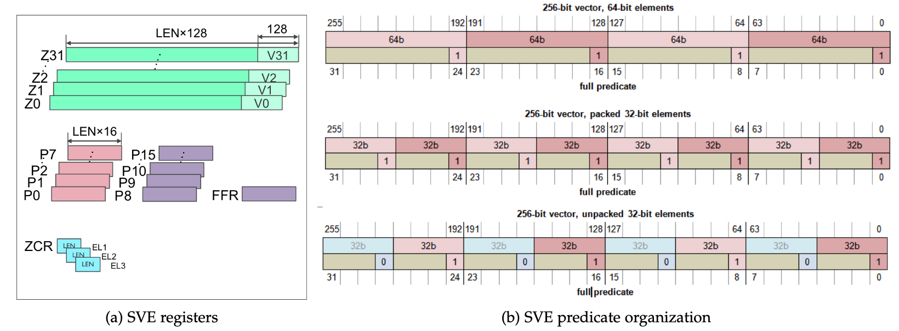
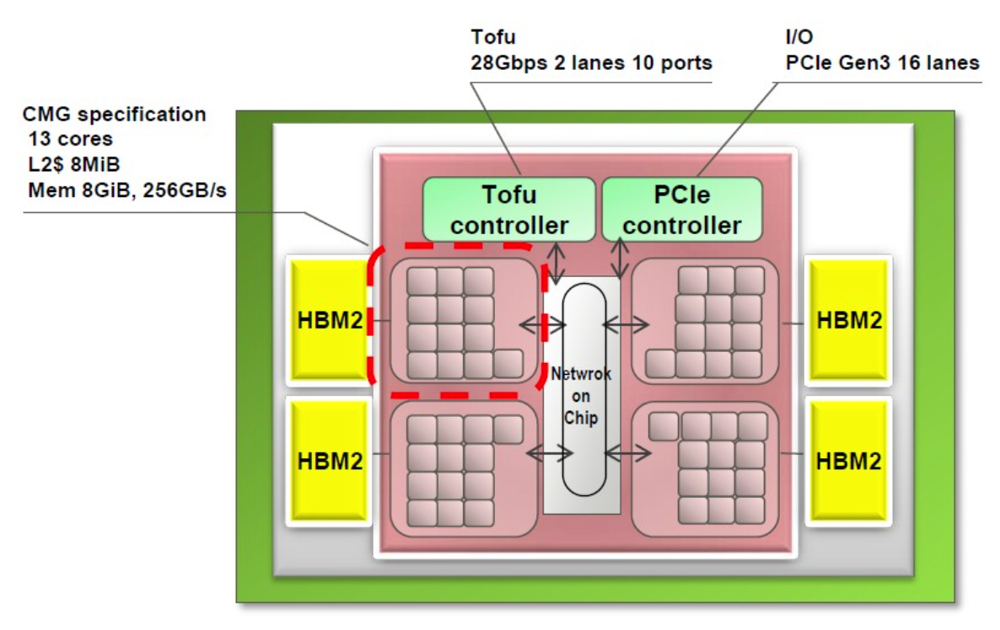

# SVE
- Scalable vector length increasing parallelism while allowing implementation choice.
- Rich addressing modes enabling non-linear data accesses.
- Per-lane predication allowing vectorization of loops containing complex control flow.
- Predicate-driven loop control and management reduces vectorization overhead relative to scalar code. A rich set of horizontal operations applicable to more types of reducible loop-carried dependencies.
- Vector partitioning and software-managed speculation enabling vectorization of loops with datadependent exits.
- Scalarized intra-vector sub-loops permitting vectorization of loops with more complex loop-carried dependencies.

## Use predicates to predict the scalable registers

This state provides thirty-two new scalable vector registers(Z0–Z31). Their width is implementation dependent withinthe  aforementioned  range.  The  new  registers  extend  thethirty-two 128-bit wide Advanced SIMD registers (V0–V31)to provide scalable containers for 64-, 32-, 16-, and 8-bit data elements.

## Arm 64FX implementation

## References
1. https://github.com/fujitsu/A64FX/tree/master/doc
2. https://www.youtube.com/watch?v=Qma7UuYifhM
3. https://www.youtube.com/watch?v=3TYVqodc8w4
4. https://www.youtube.com/watch?v=H3COrJQxBkQ