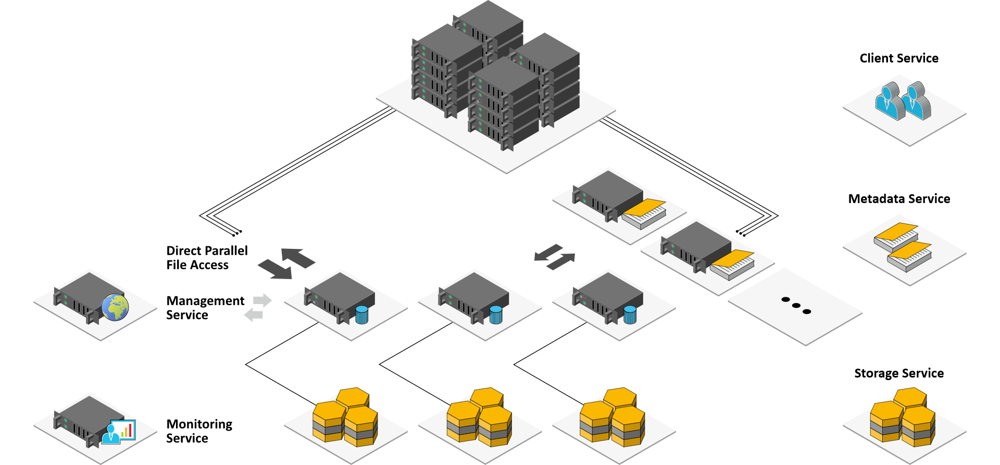

# BeeGFS

**[BeeGFS](https://www.beegfs.io/)** is a hardware-independent POSIX parallel file system developed with a strong focus on performance and designed for ease of use, simple installation, and management. 

**Please have a look at [BeeGFS Architecture overview](https://doc.beegfs.io/latest/architecture/overview.html) before continuing.**



## ℹ️ Note: For linux kernels 5.x

Currently, the BeeGFS kernel module is not compatible with the Linux kernel 5.x. We need to patch it manually.

Some work has been done by [Build kernel module against kernel version 5.8.x](https://groups.google.com/g/fhgfs-user/c/he7kgI23j5Y) and [tobydarling/beegfs-7.1.4-kernel-5.6.4](https://github.com/tobydarling/beegfs-7.1.4-kernel-5.6.4/blob/master/beegfs-7.1.4.patch.txt).

## Insallation

Please follow the [Quick Start Guide](https://doc.beegfs.io/latest/quick_start_guide/quick_start_guide.html) to install. 

Here we will only give you additional notes, assuming the operating system is Debian 10.

### Step 1: Package Download and Installation

1. Find the **last version** from [BeeGFS Package Repository](https://www.beegfs.io/release/).
2. Find the link to repository file, it should be something like:
    ```
    https://www.beegfs.io/release/beegfs_7.2.4/dists/beegfs-deb10.list
    ```
   where `7.2.4` is the version number, `deb10` is the distribution name & version.
3. Download and save the file to `/etc/apt/sources.list.d/beegfs.list`:
    ```bash
    curl -Lo /etc/apt/sources.list.d/beegfs.list <the download link>
    ```
    <!-- TODO: Import PGP Key? -->
4. Update the package list:
    ```bash
    apt-get update
    ```
5. Install the package from the repository.
   To avoid errors, you should only install the package you need. For example, you don't need to install `beegfs-mgmtd` if this machine is only a BeeGFS client.
    ```bash
    # only install the package you need!

    # management service
    apt-get install beegfs-mgmtd

    # metadata service; libbeegfs-ib is only required for RDMA
    apt install beegfs-meta libbeegfs-ib

    # storage service; libbeegfs-ib is only required for RDMA
    apt install install beegfs-storage libbeegfs-ib

    # client and command-line utils
    apt install beegfs-client beegfs-helperd beegfs-utils
    ```
6. For your convenience, consider append beegfs binary path into `PATH`, which is `/opt/beegfs/sbin/`.

### Step 2: Client Kernel Module Autobuild

Since we are using RDMA and installed InfiniBand kernel modules from Mellanox OFED, we should use `buildArgs` like this:

```conf
# /etc/beegfs/beegfs-client-autobuild.conf
buildArgs=-j8 BEEGFS_OPENTK_IBVERBS=1 OFED_INCLUDE_PATH=/usr/src/ofa_kernel/default/include
```

### Step 3: Basic Configuration

> Please read the [official guide](https://doc.beegfs.io/latest/quick_start_guide/quick_start_guide.html) carefully first, or you will waste a lot of time.\
> 请先完整阅读 [官方教程](https://doc.beegfs.io/latest/quick_start_guide/quick_start_guide.html), 不然你会浪费很多时间。\
> 請先完整閱讀 [官方指南](https://doc.beegfs.io/latest/quick_start_guide/quick_start_guide.html), 否則你會浪費很多時間。\
> [公式ガイド](https://doc.beegfs.io/latest/quick_start_guide/quick_start_guide.html)をよく読んでからでないと、多くの時間を無駄にしてしまいます。

Assuming we use such configuration:
- `epyc.node1`: management + metadata + storage + client
- `epyc.node2`: storage + client

We also assume you have appended `/opt/beegfs/sbin/` to `PATH`. Otherwise, you should use prepend this path to commands we used below.

Then on node1, the commands are:

```bash
# node1

# setup management service
beegfs-setup-mgmtd -p /geekpie/beegfs_mgmtd

# setup metadata service
beegfs-setup-meta -p /geekpie/beegfs_meta -m epyc.node1

# setup storage service
beegfs-setup-storage -p /geekpie/hpc/ -i 101 -m epyc.node1

# setup client
beegfs-setup-client -m epyc.node1
```

On node2, the commands are:

```bash
# node2

# setup storage service
beegfs-setup-storage -p /geekpie/hpc/ -i 201 -m epyc.node2

# setup client
beegfs-setup-client -m epyc.node2
```

> If you setuped more than once, please manually check configuration files since there may be some error.

### Step 4: Service Setup

With the same assumption as above, we can start the services on node1 and node2:

```bash
# node1
# start services
systemctl start beegfs-mgmtd beegfs-meta beegfs-storage beegfs-helperd beegfs-client
```

```bash
# node2
# start services
systemctl start beegfs-storage beegfs-helperd beegfs-client
```

### Step 5: Check Connectivity

We can check the connectivity using these commands:

```bash
beegfs-ctl --listnodes --nodetype=meta --nicdetails
beegfs-ctl --listnodes --nodetype=storage --nicdetails
beegfs-ctl --listnodes --nodetype=client --nicdetails
beegfs-net                # Displays connections the client is actually using
beegfs-check-servers      # Displays possible connectivity of the services
beegfs-df                 # Displays free space and inodes of storage and metadata targets
```

## Check configuration

You can check the configuration by inspecting the config files, these files are located at `/etc/beegfs/`.

Please notice that if you have setup BeeGFS twice, you may need to manually fix some configuration files, like `beegfs-storage.conf`.
