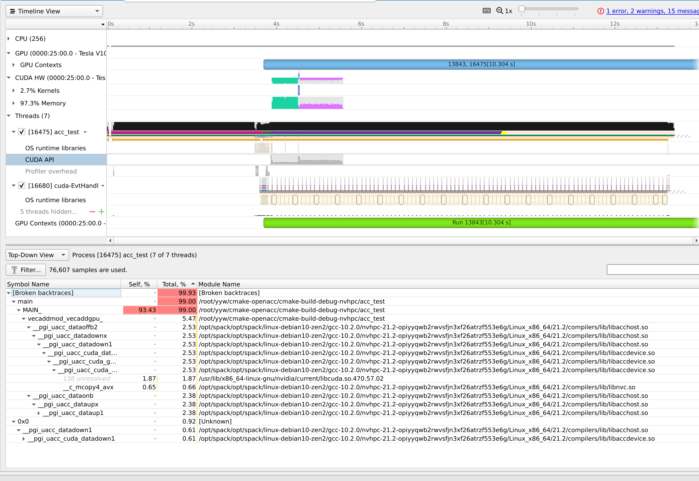

# Fortran
这个语言简直伤天害理，但确是笔者前老板最爱的语言，而且是f77，天灭fortran。可超算比赛 fortran 的上镜次数还挺多的，之前做天气应用的时候没敢改，现在既然有个小于 15w 行的程序，笔者尝试着修改。

PGI 编译器是一个商用编译器。后被 NV 收购，加了很多 fortran 可用的 cuda DSL。这无疑让 fortran 续命了不少。NVHPC 中的 Nvfortran 有很多编译器优化的 log 可以看。

[基本语法](http://micro.ustc.edu.cn/Fortran/ZJDing/)：
module 相当于 c 中的struct。
program(main)/function(normal function) 相当于 对function 的定义
```fortran
real function square(x)
    implicit none
    real, intent(in) :: x
    square = x * x
    return
end function square
program main
  integer :: n, i, errs, argcount
  real, dimension(:), allocatable :: a, b, r, e
  n = 1000000 
  call square(n)
end program
```

subroutine 相当于trait，需要有generic function 来实现
## OpenACC  
一个简单的加法
```
module mpoint
type point
    real :: x, y, z
end type
type(point) :: base(1000)
end module

subroutine vecaddgpu( r, n )
 use mpoint
 type(point) :: r(:)
 integer :: n
 !$acc parallel loop present(base) copyout(r(:))
 do i = 1, n
  r(i)%x = base(i)%x
  r(i)%y = sqrt( base(i)%y*base(i)%y + base(i)%z*base(i)%z )
  r(i)%z = 0
 enddo
end subroutine
```

Mind to use Makefile to see the Optimization info from the compiler. Also checkt the identifier loop present and copyout specify the gpu to run on.

```bash
nvfortran -MInfo -Mbounds
```

During the runtime, you can see the symbol and source file and using which GPU.

```bash
NVCOMPILER_ACC_NOTIFY=1 /root/yyw/cmake-openacc/cmake-build-debug-nvhpc/acc_test
```
Let's compared with the Kernel version. Both option `-O0 -g`
```c++
#include <iostream>
#include <cassert>
#include <cuda_runtime.h>

__global__ void vecaddgpu(int **a, int **b, int **c, int i) {
    *c[i] = *a[i] + *b[i];
}

int main(void) {
    int n = 1000000000;

    int *a = static_cast<int *>(malloc(n * sizeof(int)));
    int *b = static_cast<int *>(malloc(n * sizeof(int)));
    int *c = static_cast<int *>(malloc(n * sizeof(int))); // host copies of a, b, c
    int *e = static_cast<int *>(malloc(n * sizeof(int))); // result
    int **d_a, **d_b, **d_c;   // device copies of a, b, c
    int size = sizeof(int);
    int err = 0;

    for (int i = 0; i < n; i++) {
        a[i] = i;
        b[i] = 1000 * i;
        e[i] = a[i] + b[i];
    }

    // Allocate space for device copies of a, b, c
    cudaMalloc((void **) &d_a, size * n);
    cudaMalloc((void **) &d_b, size * n);
    cudaMalloc((void **) &d_c, size * n);

    // Copy inputs to device
    cudaMemcpy(d_a, reinterpret_cast<const void *>(a), size * n, cudaMemcpyHostToDevice);
    cudaMemcpy(d_b, reinterpret_cast<const void *>(b), size * n, cudaMemcpyHostToDevice);
    // Launch vecaddgpu() kernel on GPU with N blocks
    vecaddgpu<<<1, 1024>>>(d_a, d_b, d_c, n);
    // Copy result back to host
    cudaMemcpy(c, d_c, size * n, cudaMemcpyDeviceToHost);
    // Cleanup
    for (int i = 0; i < n; i++) {
        if (c[i] != e[i])
            err++;
    }
    free(a);
    free(b);
    free(c);
    cudaFree(d_a);
    cudaFree(d_b);
    cudaFree(d_c);
    return 0;
}
```

### 效率对比


pure cuda kernel is 1.5x faster.